Comparing methods to predict baseline mortality for excess mortality
calculations
================
Tamás Ferenci[^1]

The study is available in [PDF
format](https://raw.githubusercontent.com/tamas-ferenci/MortalityPrediction/main/README.pdf).
Preprint is uploaded to
[medRxiv](https://www.medrxiv.org/content/10.1101/2022.07.18.22277746).

## Abstract

Background: The World Health Organization’s excess mortality estimates
presented in May 2022 stirred controversy, one point of which was the
high estimate for Germany, later attributed to the used spline-model.
This paper aims to reproduce the problem using synthetic datasets, thus
allowing the investigation of its sensitivity to parameters, both of the
mortality curve and of the used method, thereby shedding light on the
conditions that gave rise to this error and its possible remedies.
Methods: A negative binomial model was used accounting for long-term
change, seasonality and flu seasons and heat waves. Simulated mortality
curves from this model were then analysed with simple methods (mean,
linear trend), with the WHO’s method and with the method of Acosta and
Irizarry. Results: The performance of the WHO’s method with its original
parametrization is indeed very poor, however it can be profoundly
improved by a better choice of parameters. The Acosta-Irizarry method
outperformed WHO’s method despite being also based on splines, but it
was also dependent on its parameters. Linear extrapolation could produce
very good results, but is highly dependent on the choice of the starting
year, while average was the worst in almost all cases. Conclusions:
Splines are not inherently unsuitable for predicting baseline mortality,
but care should be taken, in particular, results suggest that the key
issue is the rigidity of the splines. Model diagnostics must be
performed before accepting any result, and used methods should be
validated. Further research is warranted to understand how these results
can be generalized to other scenarios.

## Keywords

Excess mortality; Spline regression; Prediction; Robustness.

## Introduction

Excess mortality is the difference between the actual all-cause
mortality (number of deaths) of a time period in a given country or
(sub- or supranational) region and its “expected” mortality, defined as
the mortality statistically forecasted from the region’s historical
data. Calculation of excess mortality can be used to characterize the
impact of an event on mortality if the historical data is prior to the
onset of the event, therefore the prediction pertains to a
counterfactual: mortality that would have been observed without the
event \[1\]. Thus, the difference, i.e., excess mortality indeed
measures the impact of the event, assuming the prediction was correct.

Calculating excess mortality is particularly useful if the event’s
impact on mortality is hard to measure directly, for instance, one of
the typical applications is characterizing the mortality associated with
natural disasters \[2–4\], but is is also used for epidemics where
direct mortality registration is missing, incomplete or unreliable, a
prime example being the seasonal flu \[5,6\].

COVID-19 is no exception. While mortality is reported in developed
countries, typically daily or weekly, this suffers from two drawbacks,
first, the number of reported deaths is – while to much less extent than
the number of reported cases – but still contingent on testing activity,
which might be vastly different between countries or time periods, and
second, despite efforts at standardization the criteria for the
certification of deaths might be different between countries \[7\].
Excess mortality resolves both of these problems as it is completely
immune to differences in testing intensity and cause of death
certification procedure. This makes it especially suitable for
between-country comparisons, which is a critical issue to better
understand the pandemic, in particular, to evaluate different control
measures and responses \[8\].

This, however, comes at a price. First, and perhaps most importantly,
excess mortality is inherently a gross metric, measuring both the direct
and the indirect effects, the latter of which can be both positive
(e.g., COVID control measures also provided protection against flu) or
negative (e.g., the treatment of other diseases became less efficient)
\[9\]. Second, the excess mortality is the slowest indicator: the
necessary data, that is, the number of deaths usually becomes available
with a 4 week lag (and even that is typically revised to some extent
later) even in the developed countries (in contrast to reported
COVID-deaths, which is available by next week or even by next day).
Finally, the whole calculation depends on how accurate the forecast was.

The last of these issues will be the focus now: given the importance of
cross-country comparisons, it is crucial the results indeed reflect
differences and are not too sensitive to the used prediction method.

Only those methods will be considered now that use traditional
regression approach, i.e., methods using ARIMA models \[10–13\],
Holt-Winters method \[14\] or those based on Gaussian process \[15\]
won’t be considered, just as ensemble methods \[16,17\]. Questions
concerning age- or sex stratification or standardization \[18\], small
area estimation \[19,20\] and inclusion of covariates, such as
temperature, to improve modelling \[16,17,19\] will also not be
considered here.

This leaves us with two questions, the handling of seasonality and the
handling of long-term trend. For the latter, these are the typical
solutions in the literature concerning COVID-19:

- Using the last pre-pandemic year \[16,21\]. This is good – even if not
  perfect – considering the long-term trends, as it uses data closest to
  the investigated period, but it has a huge variance, due to the
  natural year-to-year variability of mortality.
- Using the average of a few pre-pandemic years (typically 5) \[22–28\].
  This is more reliable as averaging reduces variability, however, it is
  even more biased in case the mortality has a long-term trend (which it
  almost always has), for instance, if mortality is falling, this
  provides an overestimation, thus, excess mortality is underestimated.
- Using a linear trend extrapolation \[29–31\]. This accounts for the
  potential trends in mortality, removing the bias of the above methods,
  at least as far as linearity is acceptable, but it depends on the
  selection of the starting year from which the linear curve is fitted
  to the data. It also has higher variance than the averaging approach,
  but is is usually less of concern, given the huge amount of data
  typically used (unless a small country, and/or age or sex strata is
  investigated).
- Using splines \[32,33\]. The method of Acosta and Irizarry \[34,35\]
  is based on splines, just as many other custom implementation
  \[16,36\], which, crucially, includes the model used by the World
  Health Organization (WHO) \[37\].

While this issue received minimal public attention, the choice of the
method (and its parameters) to handle long-term trend might have a
highly relevant impact on the results of the calculation, as evidenced
by the case of the excess mortality estimation of the WHO. On May 5,
2022, WHO published its excess mortality estimates \[38\], which
immediately raised questions: among others, the estimates for Germany
were surprisingly high \[39\]. The reason why it came as a shock is that
WHO’s estimate, 195 000 cumulative excess death for Germany in the years
2020 and 2021, was inexplicably outlying from every previous estimate,
for instance, World Mortality Dataset reported 85 123 deaths for the
same period \[1\].

The case was so intriguing, that one paper termed it the “German puzzle”
\[39\]. Figure <a href="#fig:germanpuzzle">1</a> illustrates the “German
puzzle” using actual German data, with the curves fitted on 2015-2019
data and extrapolated to 2020 and 2021 (as done by the WHO): while the
dots visually indicate rather clearly a simple upward trend (as shown by
the linear extrapolation), the spline prediction turns back.

``` r
fitSpline <- mgcv::gam(outcome ~ s(Year, k = 5) + s(WeekScaled, bs = "cc"),
                       data = RawData[Year>=2015&Year<=2019,],
                       family = mgcv::nb(), method = "REML")
fitLin <- mgcv::gam(outcome ~ Year + s(WeekScaled, bs = "cc"),
                    data = RawData[Year>=2015&Year<=2019,],
                    family = mgcv::nb(), method = "REML")

predgrid <- CJ(Year = seq(2015, 2022, length.out = 100), WeekScaled = 0.5)

predSpline <- predict(fitSpline, newdata = predgrid, newdata.guaranteed = TRUE, se.fit = TRUE,
                      type = "terms")
predSpline <- data.frame(fit = predSpline$fit[, 1] + attr(predSpline, "constant"),
                         se.fit = predSpline$se.fit[,1])
predLin <- predict(fitLin, newdata = predgrid, se.fit = TRUE, type = "terms")
predLin <- data.frame(fit = predLin$fit[, 1] + attr(predLin, "constant"), se.fit = predLin$se.fit[,1])

predgrid <- rbind(cbind(predgrid, Type = "Spline", predSpline),
                  cbind(predgrid, Type = "Linear", predLin))

ggplot(predgrid, aes(x = Year, y = exp(fit),  color = Type, fill = Type)) +
  geom_line() + geom_point(data = RawDataYearly[Year>=2015&Year<=2019,],
                           aes(x = Year, y = (outcome/52.25)), inherit.aes = FALSE) +
  labs(y = "Predicted mortality [/week]")
```

<div class="figure">

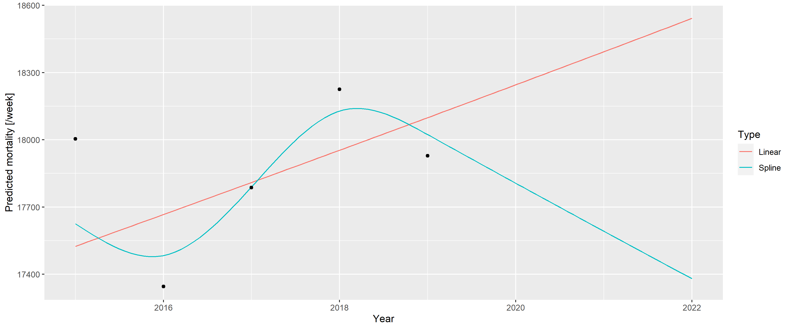
<p class="caption">
<span id="fig:germanpuzzle"></span>Figure 1: A linear trend and a spline
fitted on German mortality data 2015-2019 and extrapolated to 2020 and
2021.
</p>

</div>

The explanation later provided by the WHO \[37\] stated that the problem
was due to two issues, first, the WHO applied a rescaling method to the
raw data to compensate for underreporting (due to late registration, for
instance), but this was unnecessary in case of Germany, with excellent
death registration. Figure <a href="#fig:germanpuzzle">1</a> shows the
unadjusted German data avoiding this problem, so that focus can be
placed on the second issue that will be the subject of investigation
now: the usage of splines.

As described above, WHO’s method uses a spline to capture the long-term
trend, and it seems that the problem is that the lower data of 2015 had
a very high impact on the spline, with that single observation turning
the entire spline, despite earlier points showing an upward trend. It
seems to much weight is put on this – likely short-term, random,
noise-like – fluctuation, i.e., the extrapolation was too sensitive to
this. The culprit is quickly identified as spline-regression itself,
with one commentator saying “\[e\]xtrapolating a spline is a known bad
practice” \[39\].

But really splines are to be blamed? Motivated by obtaining a better
understanding of the “German puzzle”, this paper aims to investigate the
following questions: 1) Really splines *per se* were the culprit? 2)
What were the particlar characteristics, both of the scenario and of the
used spline-regression, that gave rise to the problem? 3) Is there a
better way to predict baseline for excess mortality calculation avoiding
this problem?

To answer these questions, first a model will be devised that is able to
generate mortality curves that capture the relevant features exhibited
by the real-life German example. Thus, it’ll be possible to calculate
the accuracy of a forecast (as the ground truth is now known), and also
to investigate how parameters of the simulation influence it. With
averaging several simulations, the mean accuracy can be approximated,
allowing the comparison of the methods, and investigating its dependence
on the parameters – both of the mortality curve and of the parameters of
the method – thereby hopefully resolving the “German puzzle”.

Note that age/sex-stratification will not be used, and the background
population will not be taken into account: while one could very well
argue for the importance of these, the WHO’s study, the investigation of
which is the aim of the present paper, also did not take these into
account.

## Methods

### Data source

Weekly all-cause mortalities for Germany were obtained from the European
Statistical Office (Eurostat), database `demo_r_mwk_ts` \[40\]. No
additional preprocessing or correction was applied such as that for late
registration, i.e., the part of the problem with the WHO’s approach due
to upscaling was avoided, so that the focus is now solely on the
modeling aspect. A detailed comparison of the possible data sources can
be found in Additional File 1.

Basic properties (raw weekly values, yearly trend, seasonal pattern) are
shown on Figure <a href="#fig:german-raw-plots">2</a>.

``` r
p1 <- ggplot(RawData[Year<=2019], aes(x = date, y = outcome)) + geom_line() +
  labs(x = "Date", y = "Mortality [/week]")
p2 <- ggplot(RawDataYearly[Year<=2019], aes(x = Year, y = outcome)) + geom_point() +
  geom_line() + geom_smooth(formula = y ~ x, method = "loess", se = FALSE) +
  labs(x = "Year", y = "Mortality [/year]")
p3 <- ggplot(RawData[Year<=2019], aes(x = Week, y = outcome, group = Year)) +
  geom_line(alpha = 0.2) + labs(x = "Week of year", y = "Mortality [/week]")

egg::ggarrange(p1, p2, p3, ncol = 1)
```

<div class="figure">

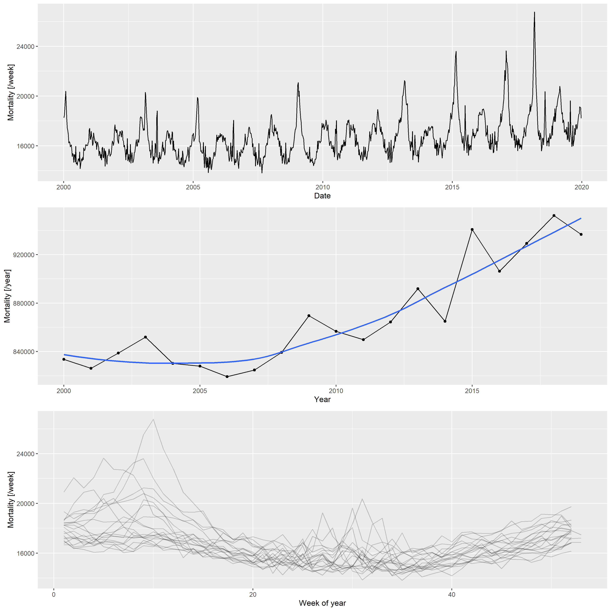
<p class="caption">
<span id="fig:german-raw-plots"></span>Figure 2: Weekly mortalities
(upper), yearly mortalities with LOESS-smoother (middle) and seasonal
pattern (bottom) of the German mortality data, 2000-2019.
</p>

</div>

### Simulation model

Based on the patterns that can be observed on Figure
<a href="#fig:german-raw-plots">2</a>, the following three components
will be used to create synthetic datasets:

- Long-term change, modelled with quadratic trend; described by three
  parameters (constant, linear and quadratic term)
- Deterministic seasonality, modelled with a single harmonic
  (sinusoidal) term; described by two parameters (amplitude and phase)
- Random additional peaks during the winter (i.e., flu season) and
  during the summer (i.e., heat waves); described in each season by five
  parameters (probability of the peak, minimum and maximum value of the
  peak height, minimum and maximum value of the peak width)

These govern the expected value; the actual counts are obtained from a
negative binomial distribution with constant size and log link function.

Thus, the number of deaths at time $t$, $D_t$, has been simulated
according to a negative binomial model
$D_t \sim \mathrm{NegBin}\left(\mu_t, s\right)$, with mean $\mu_t$ and
size parameter $s=1000$. The mean is modelled such that
$\log\left(\mu_t\right) = \beta_0 + \beta_1 \cdot t + \beta_2 \cdot t^2 + A \cdot \cos\left(2\pi \cdot w\left[t\right] + \varphi\right)$,
where $w\left[t\right]$ is the week of time $t$, scaled from 0 to 1. The
first three terms in this equation refers to the “long-term trend”
(characterized by parameters $\beta_0=10.11$,
$\beta_1=-7.36\cdot 10^{-5}$ and $\beta_2=3.04\cdot 10^{-9}$), the
latter to the seasonality (characterized by parameters $A=0.07$ and
$\varphi=-0.61$). Additionally some peaks have been randomly added to
$\log\left(\mu_t\right)$, of widths between 8.41 and 35.36 and height
between 0.11 and 0.33 positioned in the winter (uniformly between weeks
1 to 11) with a probability of 0.45 in each year and of widths between
0.86 and 9.24 and height between 0.10 and 0.24 positioned in the summer
(uniformly between weeks 26 to 37) with a probability of 0.40 in each
year. The shape of the peaks follows the probability density function of
the Cauchy distribution. These parameters were chosen so that the
simulated curves mimic the properties of the real-life mortality curve.

Detailed description of how the above model is built (including the
estimation from the actual German data which resulted in these
parameters and example of the simulated data along with real data) can
be found in Additional File 2.

### Baseline mortality prediction

Four methods will be used for predicting mortality, including the WHO’s
method, an advanced alternative method that also uses splines, developed
by Acosta and Irizarry in 2020 \[34\], and two simple methods as a
comparison. These cover the widely used, classical statistical methods
used for predicting baseline mortality in excess mortality studies.

- Average: after accounting for seasonality with a single cyclic cubic
  regression spline, the average of the preciding years will be used as
  the – constant – predicted value. The response distribution is assumed
  to be negative binomial (with the overdispersion parameter estimated
  from the data), with log link function. Parameter: starting year
  (i.e., how many previous year is used for averaging). Some studies
  used the last pre-pandemic year (2019) as the predicted baseline
  mortality, this is just the special case of this method, with the
  starting year set to 2019.
- Linear: after accounting for seasonality with a single cyclic spline,
  the long-term trend is modelled with a linear trend, that is
  extrapolated. The response distribution is assumed to be negative
  binomial (with the overdispersion parameter estimated from the data),
  with log link function. Parameter: starting year (from which the model
  is fitted).
- WHO’s method: the method is reconstructed from the description
  provided in \[37\]. In brief, seasonality is accounted with single a
  cyclic spline (as done in the previous cases), and the long-term trend
  is accounted with a thin plate regression spline. The only deviation
  compared to WHO’s paper is that the actual time (number of days since
  1970-01-01) is used as the predictor for long-term trend, not the
  abruptly changing year. The response distribution is assumed to be
  negative binomial (with the overdispersion parameter estimated from
  the data), with log link function, and the model is estimated with
  restricted maximum likelihood (REML). Second derivative penalty was
  used for constructing the spline, meaning that the forecasting will be
  a linear extrapolation. Parameters: starting year (from which the
  model is fitted) and $k$, the dimension of the basis of the spline
  used for capturing the long-term trend.
- Acosta-Irizarry (AI) method: the method described in \[34\] using
  their reference implementation. It offers many advantages when
  estimating excess mortality, however, these partly appear only in the
  second stage (i.e., calculating the excess after the expected is
  forecasted). In terms of the baseline prediction, the method is
  similar to that of WHO in using splines, with three differences:
  first, to capture seasonality, two harmonic terms are used (with
  pre-specified frequencies of 1/365 and 2/365 as default, and arbitrary
  phase estimated from the data) instead of the cyclic spline, second,
  the spline to capture the long-term trend is a natural cubic spline,
  not a thin plate regression spline, with the number of knots
  selectable. Note that if the number of years in the training data is
  less than 7, linear trend is used instead of the spline. Finally, the
  response distribution is quasi-Poisson (with log link function).
  Parameters: starting year (from which the model is fitted) and $tkpy$,
  the number of trend knots per year; other parameters are left on their
  default values (i.e., two harmonic term is used).

Table 1 provides an overview of these modelling approaches.

Table 1. Overview of the models used to create predictions.

| **Name**        | **Model**                                                                                                                                                                                                                                                                                                                                                                                                                                   |
|-----------------|---------------------------------------------------------------------------------------------------------------------------------------------------------------------------------------------------------------------------------------------------------------------------------------------------------------------------------------------------------------------------------------------------------------------------------------------|
| Average         | $Y_t \sim NegBin\left(\mu_t, \theta\right)$<br>$\log\left(\mu_t\right) = \beta_0 + f_{cc}\left(w\left[t\right]\right)$                                                                                                                                                                                                                                                                                                                      |
| Linear          | $Y_t \sim NegBin\left(\mu_t, \theta\right)$<br>$\log\left(\mu_t\right) = \beta_0 + \beta_1 t + f_{cc}\left(w\left[t\right]\right)$                                                                                                                                                                                                                                                                                                          |
| WHO             | $Y_t \sim NegBin\left(\mu_t, \theta\right)$<br>$\log\left(\mu_t\right) = f_{tp}\left(t\right) + f_{cc}\left(w\left[t\right]\right)$                                                                                                                                                                                                                                                                                                         |
| Acosta-Irizarry | $Y_t \sim QuasiPoi\left(\mu_t\right)$<br>$\log\left(\mu_t\right) = \begin{cases} \beta_0 + f_{nc}\left(t\right) + \sum_{k=1}^2 \left[\sin\left(2\pi\cdot k \cdot w\left[t\right]\right) + \cos\left(2\pi\cdot k \cdot w\left[t\right]\right)\right] \quad * \\ \beta_0 +\beta_1 t + \sum_{k=1}^2 \left[\sin\left(2\pi\cdot k \cdot w\left[t\right]\right) + \cos\left(2\pi\cdot k \cdot w\left[t\right]\right)\right] \quad ** \end{cases}$ |

Legend. cc: cyclic cubic regression spline, tp: thin plate regression
spline, nc: natural cubic spline, \*: \>7 years training data, \*\*:
$\leq$ 7 years training data, $w\left[t\right]$: week of the year scaled
to 0-1.

As already noted, population size is not included in the models,
consistent with what the WHO did for country-level analysis for
countries with frequent data available. Thus, changes in the population
size are absorbed into the changes of death count without explicit
modelling, which is clearly of potential room for improvement.

### Validation through simulation

First, a synthetic dataset is randomly generated from the model
described above using the investigated parameters (parameters of the
scenario). This dataset simulates mortalities from the beginning of 2000
to the end of 2023. Then, the investigated prediction method with the
investigated parametrization (parameters of the method) is applied, and
after fitting on the data from 2000 to 2019, a prediction is obtained
for 2020 to 2023, where it can be contrasted with the actual values of
the simulation, which represent the ground truth in this case. Denoting
the actual number of deaths in the simulated dataset for year $y$ with
$M_y = \sum_{t: y\left[t\right]=y} D_t$ and the predicted number with
$\widehat{M}_y$, the goodness of prediction is quantified with mean
squared error
($MSE = \frac{1}{4} \sum_{y=2020}^{2023} \left(M_y-\widehat{M}_y\right)^2$),
mean absolute percentage error
($MAPE = \frac{1}{4} \sum_{y=2020}^{2023} \left|\frac{M_y-\widehat{M}_y}{M_y}\right|$)
and bias
($Bs=\frac{1}{4} \sum_{y=2020}^{2023} \left(M_y-\widehat{M}_y\right)$).
This whole procedure is repeated 1000 times, and metrics are averaged
over these replications. This is then repeated for all prediction
method, all parameters of the method and all parameters of the scenario.

Investigated parameters of the prediction methods were the following:

- Average: starting year 2000, 2005, 2010, 2015, 2019
- Linear: starting year 2000, 2005, 2010, 2015
- WHO’s method: all possible combination of starting year 2000, 2005,
  2010, 2015 and $k$ (basis dimension) 5, 10, 15, 20
- Acosta-Irizarry method: all possible combination of starting year
  2000, 2005, 2010, 2015 and $tkpy$ (trend knots per year) 1/4, 1/5,
  1/7, 1/9, 1/12

For the scenario, simulations were run with the optimal parameters as
discussed previously (base case scenario) and three further parameter
sets, describing a scenarios where the long-term trend is linear
($\beta_0=10.11$, $\beta_1=-7.36\cdot 10^{-5}$ and $\beta_2=0$),
constant ($\beta_0=10.11$, $\beta_1=0$ and $\beta_2=0$) and when it is
non-monotone ($\beta_0=10$, $\beta_1=9.5\cdot 10^{-5}$ and
$\beta_2=-3\cdot 10^{-9}$). The framework allows the investigation of
any further scenario, including varying parameters other than long-term
trend, or varying several ones in a combinatorial fashion (although this
latter has a very high computational burden).

Details of the simulation are provided in Additional File 3.

### Programs used

All calculations are carried out under the R statistical program package
version 43.1 \[41\] using packages `data.table` \[42\] (version 1.14.8)
and `ggplot2` \[43\] (version 3.4.2), as well as `excessmort` (version
0.6.1), `mgcv` (version 1.8.42), `scorepeak` (version 0.1.2), `parallel`
(version 4.3.1) `lubridate` (version 1.9.2), `ISOweek` (version 0.6.2)
and `eurostat` (version 3.8.2).

Full source code allowing complete reproducibility is openly available
at <https://github.com/tamas-ferenci/MortalityPrediction>.

## Results

Figure <a href="#fig:trajs">3</a> illustrates the predictions (for
2020-2023) for the base case scenario by showing the estimated yearly
deaths for 200 randomly selected simulation together with the ground
truth for all 4 method with all possible parameters.

``` r
p1 <- ggplot() + xlim(c(2018, 2023)) + #ylim(c(0.5, 1.5)) +
  geom_line(data = predLongs$WHO[rep<=200&parsim==1],
            aes(x = Year, y = value/1e6, group = rep), alpha = 0.1) + 
  geom_line(data = predLongs$WHO[parsim==1, .(outcome = mean(outcome)), .(Year)],
            aes(x = Year, y = outcome/1e6), color = "red") +
  facet_grid(rows = vars(k), cols = vars(startyear), scales = "free") +
  labs(y = "Outcome [million death / year]", title = "A) WHO's method")

p2 <- ggplot() + xlim(c(2018, 2023)) + #ylim(c(0.5, 1.5)) +
  geom_line(data = predLongs$AI[rep<=200&parsim==1],
            aes(x = Year, y = value/1e6, group = rep), alpha = 0.1) + 
  geom_line(data = predLongs$AI[parsim==1, .(outcome = mean(outcome)), .(Year)],
            aes(x = Year, y = outcome/1e6), color = "red") +
  facet_grid(rows = vars(tkpy), cols = vars(startyear), scales = "free") +
  labs(y = "Outcome [million death / year]", title = "B) Acosta-Irizarry method")

p3 <- ggplot() + xlim(c(2018, 2023)) + #ylim(c(0.5, 1.5)) +
  geom_line(data = predLongs$Lin[rep<=200&parsim==1],
            aes(x = Year, y = value/1e6, group = rep), alpha = 0.1) + 
  geom_line(data = predLongs$Lin[parsim==1, .(outcome = mean(outcome)), .(Year)],
            aes(x = Year, y = outcome/1e6), color = "red") +
  facet_grid(cols = vars(startyear), scales = "free") +
  labs(y = "Outcome [million death / year]", title = "C) Linear trend")

p4 <- ggplot() + xlim(c(2018, 2023)) + #ylim(c(0.5, 1.5)) +
  geom_line(data = predLongs$Average[rep<=200&parsim==1],
            aes(x = Year, y = value/1e6, group = rep), alpha = 0.1) + 
  geom_line(data = predLongs$Average[parsim==1, .(outcome = mean(outcome)), .(Year)],
            aes(x = Year, y = outcome/1e6), color = "red") +
  facet_grid(cols = vars(startyear), scales = "free") +
  labs(y = "Outcome [million death / year]", title = "D) Average")

egg::ggarrange(p1, p2, p3, p4, ncol = 1, heights = c(1, 1, 0.4, 0.4))
```

<div class="figure">

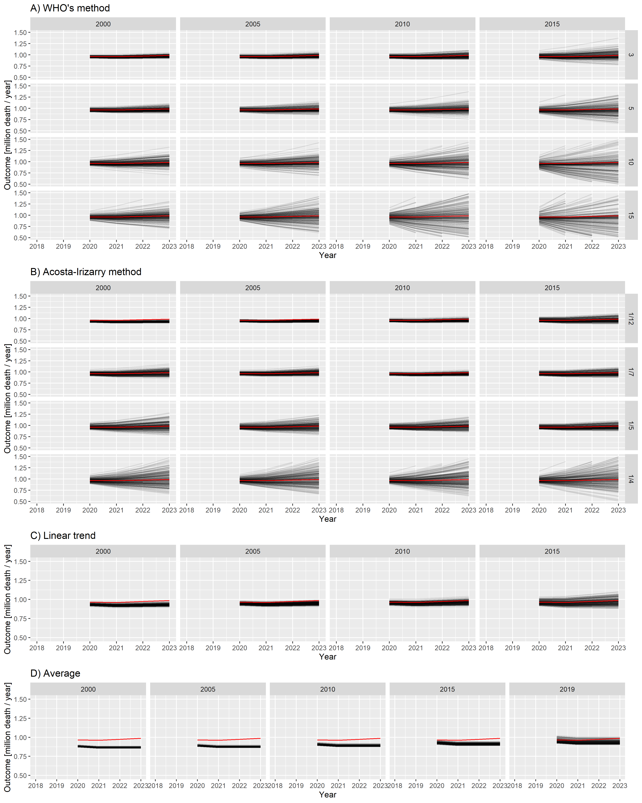
<p class="caption">
<span id="fig:trajs"></span>Figure 3: Estimated yearly deaths (for
2020-2023) for 200 randomly selected simulation together with the ground
truth: A) WHO’s method, B) Acosta-Irizarry method, C) Linear trend, D)
Average; parameters of the methods are shown in column and row headers,
parameters of the scenario are set to the base case values. (Note that
2020 is a long year, i.e., it consists of 53 weeks.)
</p>

</div>

Figure <a href="#fig:trajs">3</a> already strongly suggests some
tendencies, but to precisely evaluate it, error metrics have to be
calculated. Figure <a href="#fig:errorWHOAI">4</a>. shows all three
error metrics for all methods and for all possible parametrizations. As
it can been seen from the Figure, the ordering of the methods according
to different criteria are largely consistent.

``` r
pd <- melt(rbind(
  predLongs$WHO[parsim==1, .(Type = "WHO", rep, Year, outcome, value, startyear, param = k)],
  predLongs$AI[parsim==1, .(Type = "AI", rep, Year, outcome, value, startyear, param = as.character(tkpy))],
  predLongs$Lin[parsim==1, .(Type = "Linear", rep, Year, outcome, value, startyear, param = NA)],
  predLongs$Average[parsim==1, .(Type = "Average", rep, Year, outcome, value, startyear, param = NA)])[
    , .(logMSE = log10(mean((value-outcome)^2)), MAPE = mean(abs(value-outcome)/outcome)*100,
        Bias = mean(value-outcome)), .(Type, startyear, param)], id.vars = c("Type", "startyear", "param"))
pd$param <- factor(pd$param, levels = c(sort(unique(predLongs$WHO$k)), levels(predLongs$AI$tkpy)))

ggplot(pd, aes(x = startyear, y = value, color = param)) +
  facet_grid(variable ~ factor(Type, levels = c("WHO", "AI", "Linear", "Average")), scales = "free") +
  geom_point() + geom_line() + labs(x = "Starting year", y = "", color = "Parameter") +
  scale_color_discrete(breaks = levels(pd$param)) + guides(color = guide_legend(ncol = 2))
```

<div class="figure">

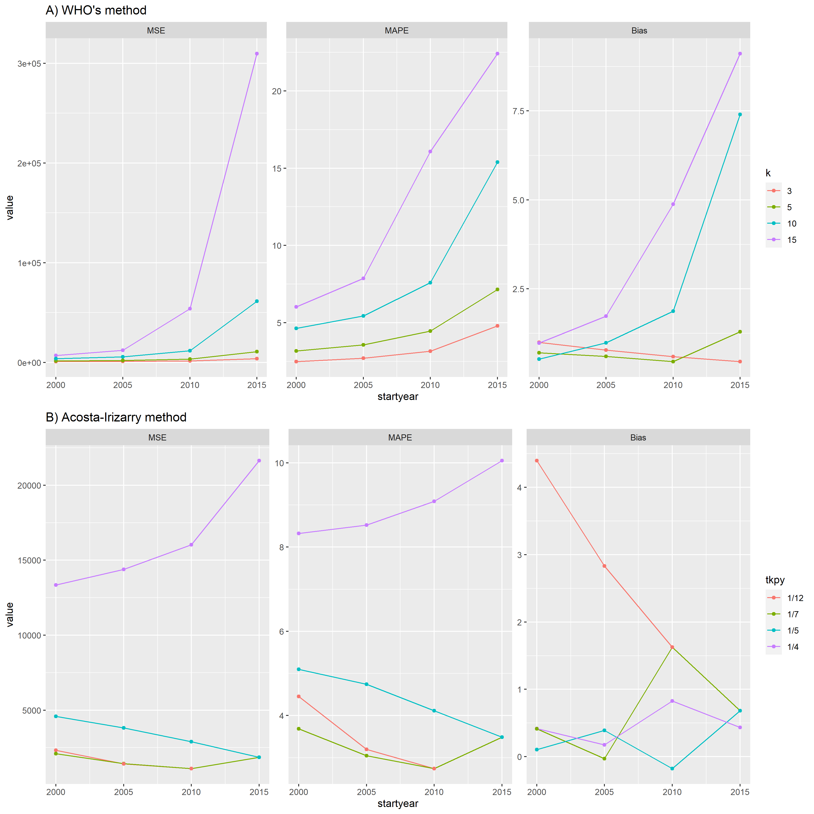
<p class="caption">
<span id="fig:errorWHOAI"></span>Figure 4: Different error metrics (MSE,
MAPE, Bias) for all methods and for all possible parameter combinations
of all methods; parameters of the scenario are set to the base case
values.
</p>

</div>

As already suggested by Figure <a href="#fig:trajs">3</a>, this confirms
that $k=3$ (WHO) and $tkpy = 1/12$ or $1/7$ (Acosta-Irizarry) are the
best parameters in this particular scenario. Note that the default value
in the method used by the WHO is $k=10$, but it is just $tkpy = 1/7$ for
the Acosta-Irizarry method.

It worth mentioning that Figures <a href="#fig:trajs">3</a> and
<a href="#fig:trajs">3</a> shed light on the nature of error. The linear
trend and average methods are particularly clear in this respect: early
starting ensures low variability, but is highly biased, a later starting
reduced the bias, but increases the variance. Thus, this is a typical
example of the bias-variance trade-off.

All the above investigations used the base case scenario for the
simulated mortality curve. Figure <a href="#fig:errorscenarios">5</a>.
shows the mean squared errors achievable with each method in the further
investigated scenarios, depending on the starting year (with k=3 for the
WHO method and tkpy = 1/7 for the AI approach).

``` r
ggplot(rbind(predLongs$WHO[k==3,.(Method = "WHO", MSE = mean((value-outcome)^2)/1e6),
                           .(startyear, parsimName)],
             predLongs$AI[invtkpy==7,.(Method = "AI", MSE = mean((value-outcome)^2)/1e6),
                          .(startyear, parsimName)],
             predLongs$Lin[,.(Method = "Linear", MSE = mean((value-outcome)^2)/1e6),
                           .(startyear, parsimName)],
             predLongs$Average[,.(Method = "Average", MSE = mean((value-outcome)^2)/1e6),
                               .(startyear, parsimName)]),
       aes(x = startyear, y = MSE, color = Method, group = Method)) + geom_point() + geom_line() +
  facet_grid(cols = vars(factor(parsimName, levels = c("Constant", "Linear trend",
                                                       "Quadratic trend", "Non-monotone")))) +
  scale_y_log10() + annotation_logticks(sides = "l")
```

<div class="figure">

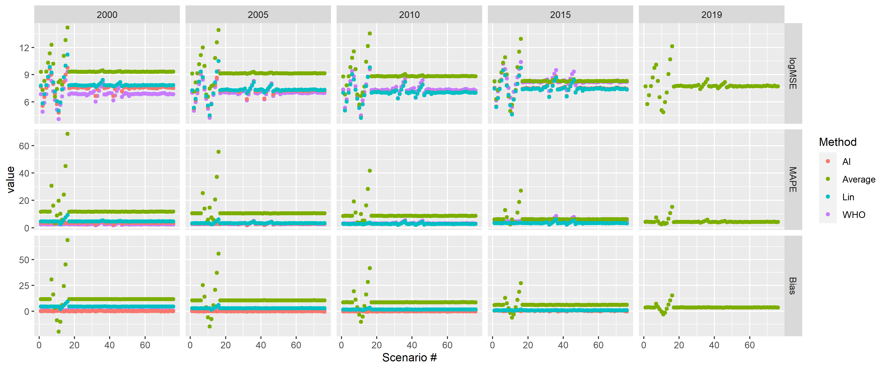
<p class="caption">
<span id="fig:errorscenarios"></span>Figure 5: Mean squared errors of
the investigated methods by starting year (with k=3 for the WHO method
and tkpy = 1/7 for the AI approach) for the four defined scenarios.
</p>

</div>

Finally, note that as different methods were evaluated on the same
simulated dataset for each simulation, it is possible to compare not
only the averages, but directly compare the errors themselves.
Additional File 4 explores this possibility.

## Discussion

These results demonstrate that we were able to reliably reproduce the
“German puzzle” using synthetic datasets. This approach allowed a deep
investigation of how the results depend on the used method, its
parameters and on the parameters of the scenario.

As expected, prediction with average has the highest error, except for
very poor parametrizations of the spline-based methods and is highly
biased. Its performance is improved by a later starting year, i.e.,
smaller bias offsets the larger variability. Naturally, it performs the
best in the – practically very unlikely – case when even the true
mortality is constant.

Linear extrapolation seems to be a very promising alternative,
comparable to the much more sophisticated spline-based methods, the only
problem being that it is very sensitive to the appropriate choice of the
starting year: that phase should be covered where the change in
historical mortality is linear. This is prone to subjectivity and might
not work at all if the linear phase is too short (limiting the available
information), i.e., it depends on how wiggly is the historical curve.
Naturally, it works best if the true mortality is linear, but can
perform very poorly with non-monotone curves when the starting year is
not selected to match the last section that can be approximated with a
linear curve, in line with the previous remark.

Splines in contrast can work theoretically well even in those cases as
non-monotone mortality: it can use all historical data, i.e., it is not
abruptly cut off as with linear extrapolation, but more weight is placed
on the trends suggested by the recent observations. At first glance,
this seems to be the ideal solution, delivering the benefits of the
linear extrapolation, but without the need to “guess” the good starting
point. However, as this investigation reveals, what is meant by “more
weight” and “recent” is crucial, and certain parameter choices can
results in very poor extrapolations, despite the tempting theoretical
properties.

The overall picture in selecting the optimal parameters, confirmed by
the results of both spline-based methods, is that splines should be
quite simple in baseline mortality prediction for excess mortality
calculation. This is the concordant conclusion from the experiences both
with the WHO method (where increasing basis dimension decreased
performance) and the Acosta-Irizarry method (where increasing trend
knots per year decreased performance).

The likely explanation is that mortality curves exhibit only slow
changes, so high flexibility is not required, and – as with any
regression model with too high model capacity – can be downright
detrimental, as it allows the model to pick up noise, i.e., can result
in overfitting.

It worth pointing out that the Acosta-Irizarry method only uses spline
to model the long-term trend if it has more than 7 years of data,
otherwise it switches to simple linear trend. This is completely in line
with the above remarks: flexibility is useful, but can backfire with
small amount of training data.

In Germany, the data for 2019 was somewhat lower, likely due to simple
random fluctuation, but unfortunately the spline was flexible enough to
be “able to take this bend”. Note that data are presented using the ISO
8601 year defintion meaning that year can be either 52 or 53 weeks long
\[44\]; from 2015 to 2019 every year is 52 weeks long except 2015 which
is one week longer. This adds to the reasons why the value of 2015 is
higher, increasing the wiggliness of the German data and thereby
potentially contributing to the problem, as the increased wigliness of
the data forces the thin plate regression spline used in the WHO’s
method to be more flexible. (This was not a problem with WHO’s original
analysis, as it used monthly data, but appears if the WHO’s method is
directly applied to weekly data.)

The WHO method is only acceptable with $k \leq 5$ (but even that
requires longer observation than starting from 2015, as was done by the
WHO), not higher. For the Acosta-Irizarry method, 1/4 trend knots per
year was definitely too flexible, perhaps even 1/5 is too high. Note
that the default value in the reference implementation of the
Acosta-Irizarry method is 1/7, and authors in fact do not recommend
using a value much higher. The WHO’s paper unfortunately does not
specify what basis dimension was used \[37\], but the default of the
package used there is $k=10$, so even $k=5$ is substantially lower, not
to speak of $k=3$. This is likely a crucial component in WHO’s
experience, where the starting year was 2015 (and probably $k=10$ was
used).

Among the two spline-based methods, when the rigidity parameters were
used that are optimal in this particular scenario, WHO’s method
performed better with longer fitting periods, Acosta-Irizarry performed
better with shorter ones. However, the performance of the
Acosta-Irizarry method was much less dependent on the starting year
(i.e., its disadvantage compared to WHO’s method was less for earlier
starting year than that of the WHO’s method for later starting years).

Perhaps one of the most important lesson learned, especially from
Figures <a href="#fig:errorWHOAI">4</a> and
<a href="#fig:errorscenarios">5</a> is that there is no “one size fits
all” optimal choice: a method that performs well for a given true
mortality curve can exhibit very poor performance for another shape of
mortality. More than that, even the optimal choice of parameters for one
given method can substantially depend on the scenario, and a parameter
that works well for one situation might be poor for another one. This
suggests that there while there are “safer choices”, there is no point
in recommending a universally “optimal” parameter. What can be done to
nevertheless select a good parameter for a particular case? Perhaps the
most important is to examine the fit of the model on historical data.
Figure <a href="#fig:germanpreds">6</a> provides an example using the
German data. The Figure shows the prediction for three years (2020 to
2022) from the historical data, using all methods and all parameters. A
quick visual inspection immediately reveals relevant and likely
meaningless predictions. The latter, unfortunately, includes that of WHO
(2015 as starting year, $k=10$), thus, this inspection would have likely
revealed the problem. Time series bootstrap and time-series
cross-validation are promising options to replace the – potentially
subjective – visual inspection with a more objective method, still using
only historical data.

``` r
pargridWHO <- expand.grid(startyear = c(2000, 2005, 2010, 2015), k = c(3, 5, 10, 15))
pargridWHO$parmethod <- paste0("WHO", seq_len(nrow(pargridWHO)))
pargridAI <- expand.grid(startyear = c(2000, 2005, 2010, 2015), invtkpy = c(4, 5, 7, 12))
pargridAI <- merge(pargridAI, data.table(invtkpy = c(4, 5, 7, 12),
                                         tkpy = c("1/4", "1/5", "1/7", "1/12")))
pargridAI$parmethod <- paste0("AI", seq_len(nrow(pargridAI)))
pargridAI$tkpy <- factor(pargridAI$tkpy, levels = c("1/12", "1/7", "1/5", "1/4"))
pargridAverage <- data.frame(startyear = c(2000, 2005, 2010, 2015, 2019))
pargridAverage$parmethod <- paste0("Average", seq_len(nrow(pargridAverage)))
pargridLin <- data.frame(startyear = c(2000, 2005, 2010, 2015))
pargridLin$parmethod <- paste0("Lin", seq_len(nrow(pargridLin)))

GERpredWHO <- sapply(1:nrow(pargridWHO), function(i)
  predict(mgcv::gam(outcome ~ s(NumTrend, k = pargridWHO$k[i]) + s(WeekScaled, bs = "cc"),
                    data = RawData[Year>=pargridWHO$startyear[i]&Year<=2019,],
                    family = mgcv::nb(), method = "REML"),
          newdata = RawData[Year>=2020&Year<=2022], type = "response"))
GERpredAI <- sapply(1:nrow(pargridAI), function(i)
  with(excessmort::compute_expected(
    cbind(RawData[Year>=pargridAI$startyear[i],], population = 1),
    exclude = seq(as.Date("2020-01-01"), max(RawData$date), by = "day"),
    frequency = nrow(RawData)/(as.numeric(diff(range(RawData$date)))/365.25),
    trend.knots.per.year = 1/pargridAI$invtkpy[i], verbose = FALSE),
    expected[date>=as.Date("2019-12-30")&date<=as.Date("2022-12-26")]))
GERpredAverage <- sapply(1:nrow(pargridAverage), function(i)
  predict(mgcv::gam(outcome ~ s(WeekScaled, bs = "cc"),
                    data = RawData[Year>=pargridAverage$startyear[i]&Year<=2019,],
                    family = mgcv::nb(), method = "REML"),
          newdata = RawData[Year>=2020&Year<=2022], type = "response"))
GERpredLin <- sapply(1:nrow(pargridLin), function(i)
  predict(mgcv::gam(outcome ~ NumTrend + s(WeekScaled, bs = "cc"),
                    data = RawData[Year>=pargridLin$startyear[i]&Year<=2019,],
                    family = mgcv::nb(), method = "REML"),
          newdata = RawData[Year>=2020&Year<=2022], type = "response"))

GERpred <- setNames(data.frame(RawData[Year>=2020&Year<=2022, c("date", "outcome")], GERpredWHO,
                            GERpredAI, GERpredAverage, GERpredLin, row.names = NULL),
                 c("date", "outcome", pargridWHO$parmethod, pargridAI$parmethod,
                   pargridAverage$parmethod, pargridLin$parmethod))

GERpred$Year <- lubridate::isoyear(GERpred$date)
GERpred$date <- NULL

GERpredYearly <- as.data.table(GERpred)[, lapply(.SD, sum), .(Year)]

GERpredLongs <- lapply(
  list(WHO = pargridWHO, AI = pargridAI, Average = pargridAverage,
       Lin = pargridLin),
  function(pg)
    merge(melt(GERpredYearly[, c("outcome", "Year", pg$parmethod), with = FALSE],
               id.vars = c("outcome", "Year"), variable.name = "parmethod"), pg))


GERpd <- rbind(GERpredLongs$WHO[, .(Type = "WHO", Year, value, startyear, param = k)],
            GERpredLongs$AI[, .(Type = "AI", Year, value, startyear, param = as.character(tkpy))],
            GERpredLongs$Lin[, .(Type = "Linear", Year, value, startyear, param = NA)],
            GERpredLongs$Average[, .(Type = "Average", Year,  value, startyear, param = NA)])
GERpd$param <- factor(GERpd$param, levels = c(sort(unique(GERpredLongs$WHO$k)),
                                              levels(GERpredLongs$AI$tkpy)))

ggplot(RawDataYearly[Year<2020, .(Year, outcome)], aes(x = Year, y = outcome/1e6)) + geom_point() +
  geom_line() +
  geom_point(data = GERpd, aes(x = Year, y = value/1e6, color = factor(param)), inherit.aes = FALSE) +
  geom_line(data = GERpd, aes(x = Year, y = value/1e6, color = factor(param)), inherit.aes = FALSE) +
  facet_grid(factor(Type, levels = c("WHO", "AI", "Linear", "Average"))~startyear) +
  scale_color_discrete(breaks = levels(GERpd$param)) + guides(color = guide_legend(ncol = 2)) +
  labs(y = "Predicted mortality [M/year]", color = "Parameter")
```

<div class="figure">

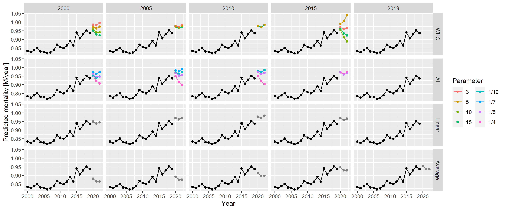
<p class="caption">
<span id="fig:germanpreds"></span>Figure 6: Predictions for 2020 to 2022
from all methods with all possible parameters, using historical German
data.
</p>

</div>

We are aware of two previous works from the literature that are
comparable to the present investigation. Both Nepomuceno et al \[45\]
and Shöley \[46\] is similar to ours in a sense that they used – among
others – several models, partly overlapping those presented here, but,
importantly, neither of them considered splines for long-term trend at
all. Nepomuceno et al did not try to evaluate the methods, it compared
them to each other without having ground truth, i.e., the aim was to
investigate concordance. In contrast, Shöley did try to give an
objective evaluation, but in contrast to the synthetic dataset
simulation approach used here, it applied time series cross-validation
with historical data to measure accuracy. Cross-validation has the
advantage that is guaranteed to be realistic – as opposed to a
simulation – but there is less freedom, as investigators are bound to
empirical data, with limited possibility in varying the parameters.

We did not investigate the impact of using the population and modelling
death rates versus modelling death counts directly, nor did we examine
the potential impact of the frequency of the data. Weekly data was used
throughout this study: this might not be available for developing
countries, but it is almost universally available for developed
countries, in which case, the use of the most frequent data seems to be
logical (with the appropriate handling of seasonality). In the same
vein, adjustment for late registration and imputation of missing data,
which might be needed where full data is not available, is not
considered here, as the focus is on developed countries.

A further limitation of the present study is that it only analyses point
estimates: the applied prediction models can provide confidence
intervals, so the investigation of their validity (such as coverage
properties) could be a relevant future research direction.

Finally, it is worth repeating that age and sex structure of the
population is not considered here (consistent with the approach of the
WHO). However, inclusion of these – together with an explicit modelling
of the population size – has the potential to improve predictions by
capturing and separating mechanisms that govern the change of population
size and structure in the models. To explore whether and to which extent
predictions could be improved by taking these into account is an
important further research area.

## Conclusion

The performance of the WHO’s method with its original parametrization is
indeed very poor as revealed by extensive simulations, i.e., the “German
puzzle” was not just an unfortunate mishap, however it can be profoundly
improved by a better choice of parameters. After that, its performance
is similar to that of Acosta-Irizarry method, with WHO slightly
dominating for longer fitting periods, Acosta-Irizarry in the shorter
ones. Despite simplicity, linear extrapolation could exhibit a good
performance, but it is highly dependent on the choice of the starting
year; in contrast, Acosta-Irizarry method exhibits a relatively stable
performance (much more stable than WHO’s method) irrespectively of the
starting year. Using the average method is almost always the worst
except for very special circumstances.

This proves that splines are not inherently unsuitable for predicting
baseline mortality, but care should be taken, in particular, these
results suggest that the key issue is that the structure of the splines
should be rigid. No matter what approach or parametrization is used,
model diagnostics must be performed before accepting the results. In
particular, it is imperative to examine the data at hand (for instance
with appropriate visualizations) to check the adequacy of the fit of the
used model. If possible, used methods should be validated with
simulations on synthetic datasets or time series cross validation or
bootstrap.

## Additional File 1: Comparison of data sources

For a country like Germany, four data sources come into consideration
for weekly mortality data: Eurostat \[40\], the Short-Term Mortality
Fluctuations (STMF) dataset of the Human Mortality Database (WMD)
\[47\], the World Mortality Database \[1\] and the national data
provider (in this case, the Federal Statistical Office of Germany). The
last is usually more complicated, limits extension to other countries
and is unnecessary for developed countries, so it’ll be avoided in this
case. Also, for Germany, WMD simply copies the data of the STMF (“We
collect the weekly STMF data for the following countries: \[…\] Germany,
\[…\].”) leaving us with two options.

We shall compare whether these two report identical data (Figure
<a href="#fig:datasources">7</a>).

``` r
RawDataEurostat <- as.data.table(eurostat::get_eurostat("demo_r_mwk_ts", time_format = "raw"))
RawDataEurostat <- RawDataEurostat[geo=="DE"&sex=="T"]
RawDataEurostat$Year <- as.numeric(substring(RawDataEurostat$time, 1, 4))
RawDataEurostat$Week <- as.numeric(substring(RawDataEurostat$time, 6, 7))

RawDataSTMF <- fread("https://www.mortality.org/File/GetDocument/Public/STMF/Outputs/stmf.csv")
RawDataSTMF <- RawDataSTMF[CountryCode=="DEUTNP"&Sex=="b"]

RawDataEurostatSTMF <- merge(RawDataEurostat[, .(Year, Week, ES = values)],
                             RawDataSTMF[, .(Year, Week, STMF = DTotal)])

ggplot(RawDataEurostatSTMF, aes(x = ES, y = STMF)) + geom_point() + geom_abline(color = "red") +
  labs(x = "Eurostat value [/week]", y = "STMF value [/week]")
```

<div class="figure">

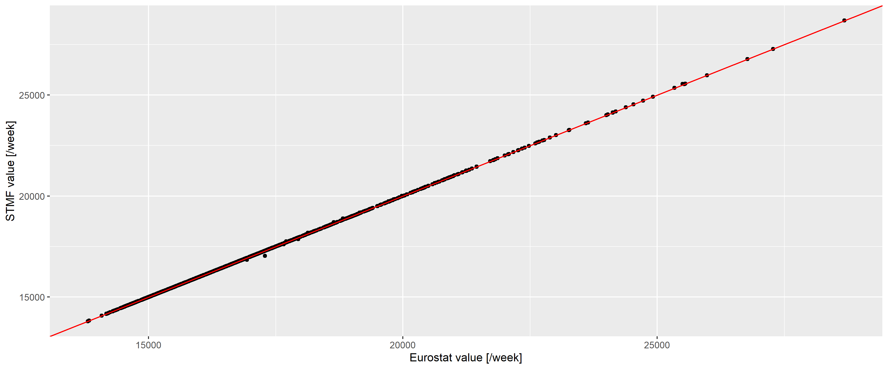
<p class="caption">
<span id="fig:datasources"></span>Figure 7: Weekly number of deaths
according to the Eurostat (horizontal axis) and the STMF database
(vertical axis) in Germany. Red line indicates the line of equality.
</p>

</div>

The two are almost identical (with a correlation of 0.9999998), with
differences only occuring for the latest data and of minimal magnitude,
so we can safely use the Eurostat database.

## Additional File 2: Generating realistic synthetic datasets

First, Figure <a href="#fig:german-raw-plots">2</a> should be inspected,
as it already gives important clues on the setup of a realistic model
from which synthetic datasets could be generated. Figure
<a href="#fig:yearsonpanels">8</a> gives further insight by plotting
each year separately.

``` r
RawData2019 <- RawData[Year<=2019]

ggplot(RawData2019, aes(x = Week, y = outcome)) + geom_line() + facet_wrap(~Year) +
  labs(x = "Week of year", y = "Mortality [/week]")
```

<div class="figure">

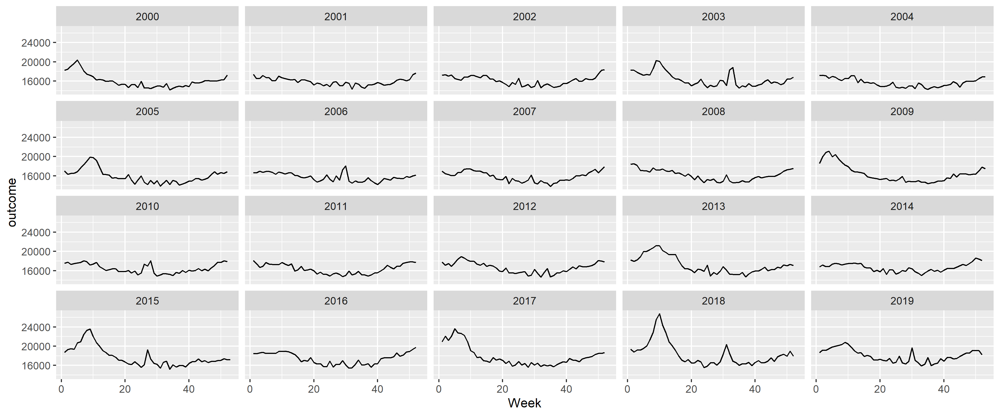
<p class="caption">
<span id="fig:yearsonpanels"></span>Figure 8: Weekly number of deaths in
Germany, separated according to year.
</p>

</div>

The following observations can be made:

- There is a long-term trend, seemingly quadratic.
- There is a strong seasonality with winter peak and summer trough.
- There are peaks – in addition to the seasonality – in the winter and
  also during the summer (although the shape seems to be different, with
  winter peaks seeming to be broader and higher).

To investigate these, first a spline-smoothing – with thin plate
regression spline \[32\] – is applied to obtain the long-term trend, and
a single harmonic term is included as a covariate to remove seasonality.
No interaction is assumed between the two, i.e., it is assumed that the
seasonal pattern is the same every year. (The peaks are not accounted
for at this stage which means that the curve is above the true one, but
the difference is likely has minimal due to the rarity and short
duration of the peaks. This will be later corrected, after the peaks
were identified.) All analysis will be carried out on the log scale
(meaning the effect of covariates is multiplicative) using negative
binomial response distribution to allow for potential overdispersion
\[48\].

Figure <a href="#fig:longterm">9</a> shows the results, overplotted with
the model where the long-term trend is a completely parametric quadratic
trend. One can observe very good fit between the two, so all subsequent
investigation will use the quadratic trend which is much easier to
handle. This is only meaningful for short-term extrapolation, but this
is what will be needed now (two years of extrapolation will be used in
the present study); also it is not possible to better differentiate
between functional forms at this sample size.

``` r
fitSpline <- mgcv::gam(outcome ~ s(NumTrend) + cos(2*pi*WeekScaled) + sin(2*pi*WeekScaled),
                       data = RawData2019, family = mgcv::nb(), method = "REML")
fit <-  mgcv::gam(outcome ~ poly(NumTrend, 2, raw = TRUE) + cos(2*pi*WeekScaled) + sin(2*pi*WeekScaled),
                  data = RawData2019, family = mgcv::nb(), method = "REML")

fitTrendMinPoint <- -coef(fit)["poly(NumTrend, 2, raw = TRUE)1"]/
  (2*coef(fit)["poly(NumTrend, 2, raw = TRUE)2"])
fitTrendMinValue <- coef(fit)["(Intercept)"]-
  coef(fit)["poly(NumTrend, 2, raw = TRUE)1"]^2/(4*coef(fit)["poly(NumTrend, 2, raw = TRUE)2"])
fitTrend2020End <- coef(fit)["poly(NumTrend, 2, raw = TRUE)2"]*18624^2 +
  coef(fit)["poly(NumTrend, 2, raw = TRUE)1"]*18624 + coef(fit)["(Intercept)"]
fitSeasonAmplitude <- sqrt(coef(fit)["sin(2 * pi * WeekScaled)"]^2 +
                             coef(fit)["cos(2 * pi * WeekScaled)"]^2)
fitSeasonPhase <- atan(-coef(fit)["sin(2 * pi * WeekScaled)"]/coef(fit)["cos(2 * pi * WeekScaled)"])

predgrid <- data.frame(NumTrend = seq(min(RawData2019$NumTrend),
                                      max(RawData2019$NumTrend), length.out = 100),
                       WeekScaled = rep(0.5, 100))
predgrid <- rbind(cbind(predgrid, Type = "Spline",
                        with(predict(fitSpline, newdata = predgrid, newdata.guaranteed = TRUE,
                                     se.fit = TRUE), data.frame(fit, se.fit))),
                  cbind(predgrid, Type = "Quadratic",
                        with(predict(fit, newdata = predgrid, newdata.guaranteed = TRUE, se.fit = TRUE),
                             data.frame(fit, se.fit))))

ggplot(predgrid, aes(x = lubridate::as_date(NumTrend), y = exp(fit), ymin = exp(fit - 1.96*se.fit),
                     ymax = exp(fit + 1.96*se.fit), color = Type, fill = Type)) +
  geom_line() + geom_ribbon(alpha = 0.2, linetype = 0) +
  labs(x = "Date", y = "Predicted number of weekly deaths (adjusted to June-30)")
```

<div class="figure">

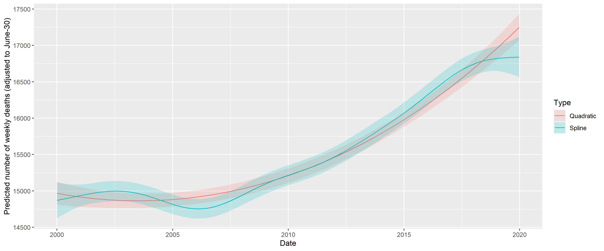
<p class="caption">
<span id="fig:longterm"></span>Figure 9: Fitting long-term trend as
spline (black) and as quadratic trend (red); shaded area indicated 95%
confidence interval. Seasonality is removed by including a single
harmonic term in the regression in both cases.
</p>

</div>

The coefficients can be transformed to equivalent forms that are more
meaningful. Thus, the three parameters of the quadratic trend can be
expressed as a minimum point (2003-07-15), value at the minimum
(15918.54) and value at the end of 2020 (18825.83). (This differs from
the value seen on Figure <a href="#fig:longterm">9</a>, as that also
includes the effect of the harmonic term.) The two parameters of the
harmonic regression can be expressed as an amplitude, a multiplier
(9.4%) and a phase shift (-0.7, i.e., minimum at week 32 of the year).

Figure <a href="#fig:longtermfit">10</a> shows the predictions of the
above model.

``` r
RawData2019$pred <- predict(fit)

ggplot(RawData2019, aes(x = Week, y = outcome)) +
  geom_line() + geom_line(aes(y = exp(pred)), color = "red") + facet_wrap(~Year) +
  labs(x = "Week of year", y = "Mortality [/week]")
```

<div class="figure">

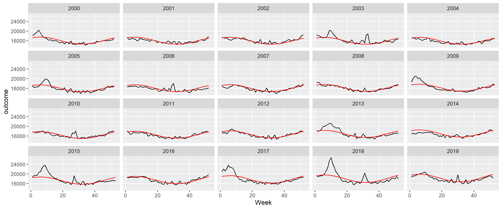
<p class="caption">
<span id="fig:longtermfit"></span>Figure 10: Weekly number of deaths in
Germany, separated according to year, showing the predictions from the
model with quadratic long-term trend and a single, fixed harmonic term.
</p>

</div>

A good fit can be observed, apart from summer and winter peaks. Thus, to
capture them, the predictions are subtracted; with the results shown on
Figure <a href="#fig:longtermfitresid">11</a>.

``` r
RawData2019$resid <- residuals(fit, type = "working")

peakdet <- scorepeak::detect_localmaxima(RawData2019$resid, 35) &
  scorepeak::score_type1(RawData2019$resid, 35)>0.1315
peaks <- data.table(x = RawData2019$NumTrend[peakdet], y = RawData2019$resid[peakdet])
peaks$peakDate <- lubridate::as_date(peaks$x)
peaks$Year <- lubridate::isoyear(peaks$peakDate)
peaks$peakWeek <- lubridate::isoweek(peaks$peakDate)
peaks$peakID <- 1:nrow(peaks)

ggplot(RawData2019, aes(x = Week, y = resid)) +  geom_line() + facet_wrap(~Year) +
  geom_point(data = peaks, aes(x = peakWeek, y = y)) +
  labs(x = "Week of the year", y = "Working residual (log scale)")
```

<div class="figure">

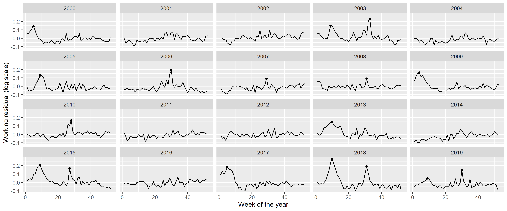
<p class="caption">
<span id="fig:longtermfitresid"></span>Figure 11: Residuals of the
fitted model with quadratic long-term trend and a single, fixed harmonic
term. Dots indicate identified peaks.
</p>

</div>

Peaks in the residuals were identified with the peak detector of
Palshikar \[49\] using parameters that were empirically tuned to
identify to visually clear peaks. Results are shown on Figure
<a href="#fig:longtermfitresid">11</a> with black dots; an indeed good
identification of the unequivocal peaks can be seen.

Figure <a href="#fig:peakneigh">12</a> shows the peaks themselves with a
$\pm$ 100 days neighbourhood. This reinforces the idea that summer and
winter peaks are somewhat different, but more importantly, suggests that
the rescaled probability density function of the Cauchy distribution,
i.e., $\frac{a}{\pi s}\frac{1}{1+\left(\frac{x-x_0}{s}\right)^2}+b$
might be a good – and parsimonious – function form to capture the shape
of the peaks.

``` r
RawData2019$peakID <- sapply(1:nrow(RawData2019),
                             function(i) which.min(abs(RawData2019$NumTrend[i]-peaks$x)))
RawData2019$peakdist <- sapply(1:nrow(RawData2019),
                               function(i) RawData2019$NumTrend[i]-peaks[RawData2019$peakID[i],]$x)

RawData2019 <- merge(RawData2019, peaks[, .(peakID, peakWeek)])
RawData2019$peakText <- paste0(RawData2019$peakID, " (Week: ", RawData2019$peakWeek, ")")
RawData2019$peakText <- factor(RawData2019$peakText, levels = unique(RawData2019$peakText))

minfun <- function(x, data) sum((data$resid-(x["a"]*dcauchy(data$peakdist, x["x0"], exp(x["s"]))+x["b"]))^2)

RawData2019[, c("fitpeak", "x0", "s", "a", "b") :=
              with(optim(c(a = 10, x0 = 0, s = 0, b = 0), minfun,
                         data = .SD[abs(peakdist)<100, .(resid = resid, peakdist)]),
                   list(dcauchy(peakdist, par["x0"], exp(par["s"]))*par["a"],
                        par["x0"], exp(par["s"]), par["a"],par["b"])), .(peakID)]

ggplot(RawData2019[abs(peakdist)<100], aes(x = peakdist, y = resid)) + geom_line() +
  geom_point() + facet_wrap(~peakText) + geom_line(aes(y = fitpeak + b), color = "red") +
  labs(x = "Distance from the peak [day]", y = "Working residual (log scale)")
```

<div class="figure">

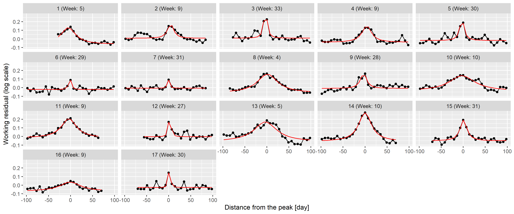
<p class="caption">
<span id="fig:peakneigh"></span>Figure 12: 100-day width neighbourhood
of the identified peaks. Red line indicates the best fitting rescaled
Cauchy density.
</p>

</div>

To check this theory, the best fitting function was found for each peak
individually using the Nelder-Mead method \[50\] with mean squared error
objective function. Results are shown on <a href="#fig:peakneigh">12</a>
as red lines; an almost perfect fit can be observed for all peaks
confirming the initial idea of using Cauchy density.

This now puts us in a position to investigate the distribution of the
parameters (i.e., $a$, $b$, $s$ and $x_0$), which is shown on Figure
<a href="#fig:peakparamdist">13</a> separated according to whether the
peak is during the summer or not. Peak height is also calculated,
defined as height at zero (which is
$\frac{a}{\pi s \left(1+\frac{x_0^2}{s^2}\right)}$) not the actual
maximum height (which is at $x_0$) to avoid extremely large heights –
which were never actually observed – due to peaks with small $s$, i.e.,
very narrow peaks.

``` r
peaks <- merge(peaks, unique(RawData2019[, .(peakID, x0, s, a, b)]))
peaks$Summer <- peaks$peakWeek>10 & peaks$peakWeek<35
peaks$amplitude <- peaks$a/(pi*peaks$s*(1+peaks$x0^2/peaks$s^2))

fitWinterAmplitudeMin <- min(peaks[Summer==FALSE]$amplitude)
fitWinterAmplitudeMax <- max(peaks[Summer==FALSE]$amplitude)
fitWinterSigmaMin <- min(peaks[Summer==FALSE]$s)
fitWinterSigmaMax <- max(peaks[Summer==FALSE]$s)
fitWinterProb <- sum(!peaks$Summer)/(diff(range(RawData2019$Year)) + 1)

fitSummerAmplitudeMin <- min(peaks[Summer==TRUE]$amplitude)
fitSummerAmplitudeMax <- max(peaks[Summer==TRUE]$amplitude)
fitSummerSigmaMin <- min(peaks[Summer==TRUE]$s)
fitSummerSigmaMax <- max(peaks[Summer==TRUE]$s)
fitSummerProb <- sum(peaks$Summer)/(diff(range(RawData2019$Year)) + 1)

ggplot(melt(peaks[, .(peakID, Summer, s, a, peakWeek, amplitude)], id.vars = c("peakID", "Summer")),
       aes(x = value, y = Summer)) + facet_wrap(~variable, scales = "free") + geom_point()
```

<div class="figure">

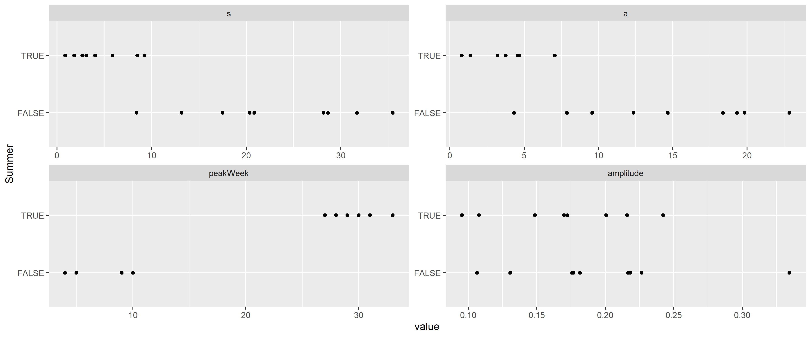
<p class="caption">
<span id="fig:peakparamdist"></span>Figure 13: Distribution of the
parameters of the best fitting rescaled Cauchy densities for each peak,
separated according to whether the peak is during the summer.
</p>

</div>

This verifies that the width is indeed different, with the $s$ of the
summer peaks being below 10, and the winter peaks being above, i.e.,
summer peaks are shorter in duration, raise and fall faster.
Interestingly, the peak heights are not substantially different between
winter and summer. Also note that the probability of having a peak at
all is different: there are 8 summer peaks and 9 winter peaks (from 20
years). Winter peaks occur between weeks 4 and 10, summer peaks occur
from weeks 25 to 35.

This allows the removal of the peaks (Figure
<a href="#fig:peaksremoved">14</a>), and, after these peaks are removed,
it is possible to re-estimate trend and seasonality, now without the
biasing effect of the peaks. This “bootstrap” procedure is adequate
after this second iteration, as no further peaks can be seen after the
removal of the re-estimated trend and seasonality.

``` r
ggplot(RawData2019, aes(x = Week, y = log(outcome))) + geom_line() + facet_wrap(~Year) +
  geom_line(aes(y = log(outcome) - fitpeak), color = "red") +
  labs(x = "Week of the year", y = "Outcome (log scale)")
```

<div class="figure">

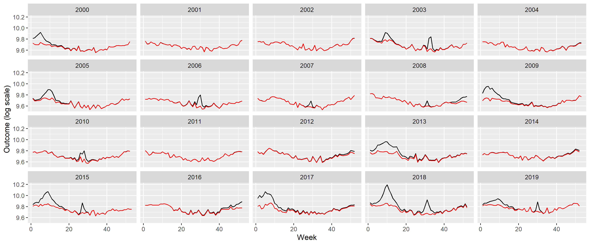
<p class="caption">
<span id="fig:peaksremoved"></span>Figure 14: Weekly number of deaths in
Germany, separated according to year (black) and with peaks removed
(red).
</p>

</div>

Creating the appropriate model to simulate such peaks is not
straightforward: there is stochasticity in the position of the peaks and
in its shape, i.e., height and width. (Actually, even the presence of a
peak is stochastic.) The following procedure will be used: the presence
is generated as a Bernoulli random variate (with the probabilities
described above, different for summer and winter), the onset date is
uniformly distributed (from 0 to 0.2 in scaled weeks for the winter peak
and from 0.5 to 0.7 for the summer peak), i.e., the position itself is
random, but the parameters of the underyling distribution are fixed. The
$b$ parameter is set to zero (irrespectively of its estimated value, to
really capture only the peak, locally – a non-zero $b$ would mean a
non-local effect), while $s$ and $a$ are randomly generated for each
peak, again, separately for summer and winter peaks. Given the high
correlation between $s$ and $a$, not these, but rather $s$ (width) and
the amplitude will be generated as a random variate from – independent –
uniform distributions. The parameters (minimum and maximum) of the
uniform distributions both for $s$ and the amplitude will be considered
as a parameter (hyperparameter) of the simulational procedure, just as
the $p$ probability of the Bernoulli distribution, all different for
summer and winter.

The following table summarizes the parameters:

``` r
fit <- mgcv::gam(I(log(outcome)-fitpeak) ~ poly(NumTrend, 2, raw = TRUE) + cos(2*pi*WeekScaled) +
                   sin(2*pi*WeekScaled), data = RawData2019,  method = "REML")

fitSeasonAmplitude <- sqrt(coef(fit)["sin(2 * pi * WeekScaled)"]^2 +
                             coef(fit)["cos(2 * pi * WeekScaled)"]^2)
fitSeasonPhase <- atan(-coef(fit)["sin(2 * pi * WeekScaled)"]/coef(fit)["cos(2 * pi * WeekScaled)"])

fittedpars <- setNames(c(coef(fit)[1:3], fitSeasonAmplitude, fitSeasonPhase,
                         fitWinterAmplitudeMin, fitWinterAmplitudeMax, fitWinterSigmaMin,
                         fitWinterSigmaMax, fitWinterProb,
                         fitSummerAmplitudeMin, fitSummerAmplitudeMax, fitSummerSigmaMin,
                         fitSummerSigmaMax, fitSummerProb),
                       c("TrendConst", "TrendLin", "TrendQuadr",
                         "SeasonAmplitude", "SeasonPhase",
                         "WinterAmplitudeMin", "WinterAmplitudeMax", "WinterSigmaMin",
                         "WinterSigmaMax", "WinterProb",
                         "SummerAmplitudeMin", "SummerAmplitudeMax", "SummerSigmaMin",
                         "SummerSigmaMax", "SummerProb"))
knitr::kable(data.table(
  Parameter = c("Constant term of the trend", "Linear term of the trend",
                "Quadratic term of the trend", "Amplitude of seasonality (log scale)",
                "Phase of seasonality", "Minimum of winter peak amplitude (log scale)",
                "Maximum of winter peak amplitude (log scale)", "Minimum of winter peak width",
                "Maximum of winter peak width", "Probability of winter peak",
                "Minimum of summer peak amplitude (log scale)",
                "Maximum of summer peak amplitude (log scale)",
                "Minimum of summer peak width", "Maximum of summer peak width",
                "Probability of summer peak", "Size parameter of the negative binomial distribution"),
  Value = paste0("$", gsub("e", "\\\\cdot 10^{", format(c(fittedpars, 1000), scientific = TRUE, digits = 3,
                                                        trim = TRUE)), "}$")))
```

| Parameter                                            | Value                 |
|:-----------------------------------------------------|:----------------------|
| Constant term of the trend                           | $1.01\cdot 10^{+01}$  |
| Linear term of the trend                             | $-7.36\cdot 10^{-05}$ |
| Quadratic term of the trend                          | $3.04\cdot 10^{-09}$  |
| Amplitude of seasonality (log scale)                 | $7.34\cdot 10^{-02}$  |
| Phase of seasonality                                 | $-6.13\cdot 10^{-01}$ |
| Minimum of winter peak amplitude (log scale)         | $1.06\cdot 10^{-01}$  |
| Maximum of winter peak amplitude (log scale)         | $3.34\cdot 10^{-01}$  |
| Minimum of winter peak width                         | $8.41\cdot 10^{+00}$  |
| Maximum of winter peak width                         | $3.55\cdot 10^{+01}$  |
| Probability of winter peak                           | $4.50\cdot 10^{-01}$  |
| Minimum of summer peak amplitude (log scale)         | $9.53\cdot 10^{-02}$  |
| Maximum of summer peak amplitude (log scale)         | $2.42\cdot 10^{-01}$  |
| Minimum of summer peak width                         | $8.63\cdot 10^{-01}$  |
| Maximum of summer peak width                         | $9.24\cdot 10^{+00}$  |
| Probability of summer peak                           | $4.00\cdot 10^{-01}$  |
| Size parameter of the negative binomial distribution | $1.00\cdot 10^{+03}$  |

``` r
saveRDS(fittedpars, "fittedpars.rds")
```

Given the mechanism described above, the procedure to simulate synthetic
datasets can easily be created. Of course, as every calculation is
carried out on the log scale, the mean should be exponentiated at the
last step.

``` r
simdat <- function(TrendConst, TrendLin, TrendQuadr, SeasonAmplitude, SeasonPhase,
                   WinterAmplitudeMin, WinterAmplitudeMax, WinterSigmaMin, WinterSigmaMax, WinterProb,
                   SummerAmplitudeMin, SummerAmplitudeMax, SummerSigmaMin, SummerSigmaMax, SummerProb) {
  
  SimData <- data.frame(date = seq(as.Date("2000-01-03"), as.Date("2023-12-25"), by = 7))
  SimData$NumTrend <- as.numeric(SimData$date)
  SimData$WeekScaled <- lubridate::isoweek(SimData$date)/
    lubridate::isoweek(paste0(lubridate::isoyear(SimData$date), "-12-28"))
  
  SimData$logmu <- TrendConst + TrendLin*SimData$NumTrend + TrendQuadr*SimData$NumTrend^2 +
    SeasonAmplitude*cos(SimData$WeekScaled*2*pi + SeasonPhase)
  
  SimData$logmu <- SimData$logmu + rowSums(sapply(2000:2019, function(y) {
    if(rbinom(1, 1, WinterProb)==0) return(rep(0, nrow(SimData))) else {
      amplitude <- runif(1, WinterAmplitudeMin, WinterAmplitudeMax)
      sigm <- runif(1, WinterSigmaMin, WinterSigmaMax)
      dcauchy(SimData$NumTrend,
              as.numeric((as.Date(paste0(y, "-01-01")) + runif(1, 0, 0.2)*7*52.25)),
              sigm)*(pi*sigm*amplitude)
    }
  }))
  
  SimData$logmu <- SimData$logmu + rowSums(sapply(2000:2019, function(y) {
    if(rbinom(1, 1, SummerProb)==0) return(rep(0, nrow(SimData))) else {
      amplitude <- runif(1, SummerAmplitudeMin, SummerAmplitudeMax)
      sigm <- runif(1, SummerSigmaMin, SummerSigmaMax)
      dcauchy(SimData$NumTrend,
              as.numeric((as.Date(paste0(y, "-01-01")) + runif(1, 0.5, 0.7)*7*52.25)),
              sigm)*(pi*sigm*amplitude)
    }
  }))
  
  SimData$outcome <- rnbinom(nrow(SimData), mu = exp(SimData$logmu), size = 1000)
  
  SimData
}
```

Figure <a href="#fig:simillustration">15</a> illustrates the synthetic
data set creation with a single simulation. (Of course, to assess the
correctness of the simulation, several realizations have to be
inspected.) In addition to the plots of
<a href="#fig:german-raw-plots">2</a>, it also gives the autocorrelation
function so that it can also be compared. (The simulated outcomes are
themselves independent – meaning that effects like the increased
probability of a flu season if the previous year did not have one are
neglected –, but the trend, seasonality and the peaks induce a
correlation structure.)

``` r
set.seed(1)

SimData <- as.data.table(do.call(simdat, as.list(fittedpars)))
SimData$Type <- "Simulated"
SimData$Week <- lubridate::isoweek(SimData$date)
SimData$Year <- lubridate::isoyear(SimData$date)

SimDataYearly <- SimData[, .(outcome = sum(outcome)), .(Year, Type)]

p1 <- ggplot(rbind(SimData[Year<=2019], RawData[Year<=2019]),
             aes(x = date, y = outcome, group = Type, color = Type)) + geom_line() +
  labs(x = "Date", y = "Mortality [/week]")

p2 <- ggplot(rbind(SimDataYearly[Year<=2019], RawDataYearly[Year<=2019]),
             aes(x = Year, y = outcome, group = Type, color = Type)) + geom_point() +
  geom_line() + labs(y = "Mortality [/year]")

p3 <- ggplot(rbind(SimData[Year<=2019], RawData[Year<=2019]),
             aes(x = Week, y = outcome, group = Year)) + facet_wrap(~Type) +
  geom_line(alpha = 0.2) + labs(x = "Week of the year", y = "Mortality [/week]")

p4 <- ggplot(rbind(with(acf(RawData$outcome, plot = FALSE),
                        data.table(Type = "Actual", acf = acf[, 1, 1], lag = lag[, 1, 1])),
                   with(acf(SimData$outcome, plot = FALSE),
                        data.table(Type = "Simulated", acf = acf[, 1, 1], lag = lag[, 1, 1]))),
             aes(x = lag - 1/4 + as.numeric(Type=="Simulated")/2,
                 xend = lag - 1/4 + as.numeric(Type=="Simulated")/2, y = acf, yend = 0, color = Type)) +
  geom_line() + geom_point() + geom_hline(yintercept = 0, col = "black") +
  labs(x = "Lag", y = "Autocorrelation")

egg::ggarrange(p1, p2, p3, p4, ncol = 1)
```

<div class="figure">

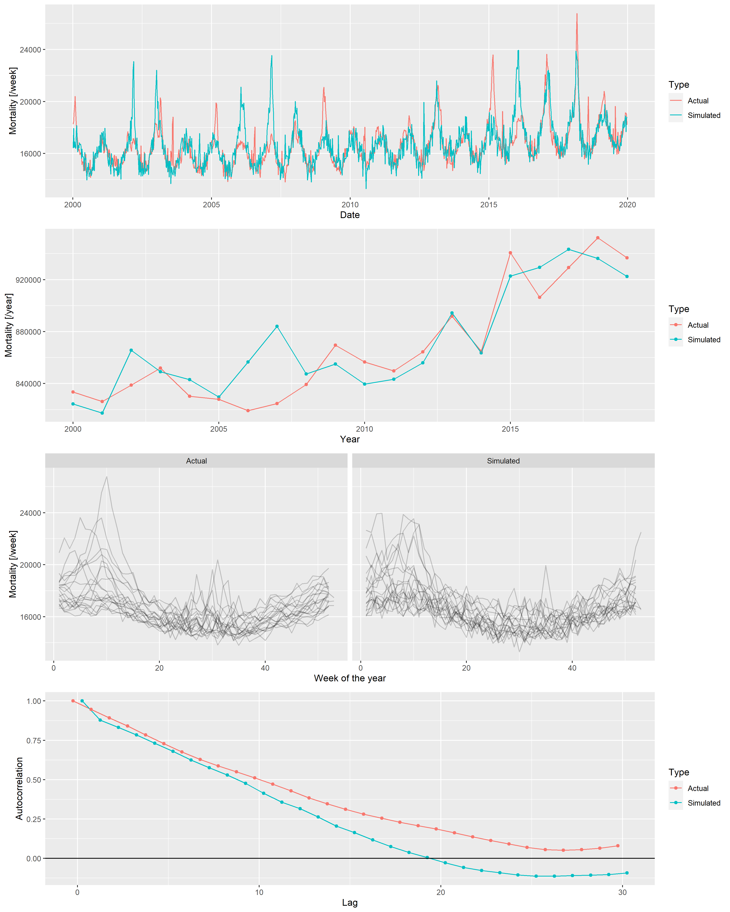
<p class="caption">
<span id="fig:simillustration"></span>Figure 15: From top to bottom:
weekly mortalities, yearly mortalities, seasonal pattern and
autocorrelation function of the actual German mortality data and a
single simulated dataset, 2000-2019.
</p>

</div>

Several simulations confirm an overall good fit between the actual data
set and the simulated ones. Thus, it is now possible to investigate the
properties of the mortality prediction on algorithms using simulated
datasets, where the actual outcome is known, and the parameters can be
varied.

## Additional File 3: Validation through simulation

Two sets of parameters have to be set up: parameters of the simulation
(i.e., parameters of the scenario, on which the methods will be run) and
parameters of the methods. They’re set up as given in the main text.

``` r
pargridSim <- as.data.table(t(fittedpars))
pargridSim <- rbind(pargridSim,
                    data.table(TrendConst = pargridSim$TrendConst, TrendLin = pargridSim$TrendLin,
                               TrendQuadr = 0, pargridSim[, -(1:3)]),
                    data.table(TrendConst = pargridSim$TrendConst, TrendLin = 0,
                               TrendQuadr = 0, pargridSim[, -(1:3)]),
                    data.table(TrendConst = 10, TrendLin = 9.5e-05,
                               TrendQuadr = -3e-09, pargridSim[, -(1:3)]))
```

One thousand simulation will be run for each parameter of the scenario,
and for each of the 1000 simulated data set all 4 methods with all
possible parameters of the methods will be evaluated. To increase the
speed, simulations will be run in parallel. (The problem is
embarrassingly parallel, as different simulations are completely
independent of each other \[51\].)

``` r
if(!file.exists("predLongs.rds")) {
  cl <- parallel::makeCluster(parallel::detectCores()-1)
  parallel::clusterExport(cl, c("pargridSim", "pargridWHO", "pargridAI",
                                "pargridAverage", "pargridLin", "simdat"), envir = environment())
  
  pred <- do.call(rbind, parallel::parLapply(cl, 1:1000, function(j) {
    do.call(rbind, lapply(1:nrow(pargridSim), function(k) {
      SimData <- do.call(simdat, as.list(pargridSim[k, ]))
      SimData$Year <- lubridate::isoyear(SimData$date)
      
      predWHO <- sapply(1:nrow(pargridWHO), function(i)
        predict(mgcv::gam(outcome ~ s(NumTrend, k = pargridWHO$k[i]) + s(WeekScaled, bs = "cc"),
                          data = SimData[SimData$Year>=pargridWHO$startyear[i]&SimData$Year<=2019,],
                          family = mgcv::nb(), method = "REML"),
                newdata = SimData[SimData$Year>=2020,], type = "response"))
      
      predAI <- sapply(1:nrow(pargridAI), function(i)
        with(excessmort::compute_expected(
          cbind(SimData[SimData$Year>=pargridAI$startyear[i],], population = 1),
          exclude = seq(as.Date("2020-01-01"), max(SimData$date), by = "day"),
          frequency = nrow(SimData)/(as.numeric(diff(range(SimData$date)))/365.25),
          trend.knots.per.year = 1/pargridAI$invtkpy[i], verbose = FALSE),
          expected[date>=as.Date("2019-12-30")]))
      
      predAverage <- sapply(1:nrow(pargridAverage), function(i)
        predict(mgcv::gam(outcome ~ s(WeekScaled, bs = "cc"),
                          data = SimData[SimData$Year>=pargridAverage$startyear[i]&SimData$Year<=2019,],
                          family = mgcv::nb(), method = "REML"),
                newdata = SimData[SimData$Year>=2020,], type = "response"))
      
      predLin <- sapply(1:nrow(pargridLin), function(i)
        predict(mgcv::gam(outcome ~ NumTrend + s(WeekScaled, bs = "cc"),
                          data = SimData[SimData$Year>=pargridLin$startyear[i]&SimData$Year<=2019,],
                          family = mgcv::nb(), method = "REML"),
                newdata = SimData[SimData$Year>=2020,], type = "response"))
      
      setNames(data.frame(j, k, SimData[SimData$Year>=2020, c("date", "outcome")], predWHO,
                          predAI, predAverage, predLin, row.names = NULL),
               c("rep", "parsim", "date", "outcome", pargridWHO$parmethod, pargridAI$parmethod,
                 pargridAverage$parmethod, pargridLin$parmethod))
    }))
  }))
  
  parallel::stopCluster(cl)
  
  pred$Year <- lubridate::isoyear(pred$date)
  pred$date <- NULL
  
  predYearly <- as.data.table(pred)[, lapply(.SD, sum), .(rep, parsim, Year)]
  
  predLongs <- lapply(
    list(WHO = pargridWHO, AI = pargridAI, Average = pargridAverage,
         Lin = pargridLin),
    function(pg)
      merge(merge(melt(predYearly[, c("rep", "parsim", "outcome", "Year", pg$parmethod), with = FALSE],
                       id.vars = c("rep", "parsim", "outcome", "Year"), variable.name = "parmethod"), pg),
            data.table(parsim = 1:4,
                       parsimName = c("Quadratic trend", "Linear trend", "Constant", "Non-monotone")),
            by = "parsim"))
  
  saveRDS(predLongs, "predLongs.rds")
} else predLongs <- readRDS("predLongs.rds")
```

## Additional File 4: Directly comparing the errors in simulation runs

As different methods were evaluated on the same simulated dataset for
each simulation, it is possible to compare not only the averages, but
directly compare the errors themselves. Figure
<a href="#fig:errordirect">16</a> shows direct comparison between the
best parametrization of the WHO’s method and the Acosta-Irizarry method
for 200 randomly selected simulations in each scenario, with 2015 as the
starting year. In the base case scenario, Acosta-Irizarry performed
better in 55.4% of the cases.

``` r
ggplot(merge(predLongs$WHO[startyear==2015&k==3, .(errorWHO = mean((value-outcome)^2)),
                           .(rep, parsimName)],
             predLongs$AI[startyear==2015&invtkpy==7, .(errorAI = mean((value-outcome)^2)),
                          .(rep, parsimName)])[rep<=200],
       aes(x = errorWHO, y = errorAI, color = factor(parsimName))) +
  geom_point() + geom_abline(color = "red") +
  scale_x_log10(labels = scales::label_log()) + scale_y_log10(labels = scales::label_log()) +
  annotation_logticks() +
  labs(x = "Mean squared error, WHO method (starting year: 2015, k = 3)",
       y = "Mean squared error, Acosta-Irizarry method (starting year: 2015, trend knots per year = 1/7)",
       color = "Scenario") + scale_color_discrete()
```

<div class="figure">


<p class="caption">
<span id="fig:errordirect"></span>Figure 16: Errors – squared distance
of the predicted outcome from its true value – of the WHO’s method and
the Acosta-Irizarry method (under best parametrization) on the same
simulated datasets for 200 randomly selected simulations with different
scenarios; black dots indicate the base case scenario, scenario \#1 to
\#5 represent varying the parameter shown on the panel from half of its
base case value to twice (with the exception of the constant term where
it is varied from 90% to 110%), and probabilities are limited to be
below 100%.
</p>

</div>

## References

<div id="refs" class="references csl-bib-body">

<div id="ref-karlinskyTrackingExcessMortality2021b" class="csl-entry">

1\. Karlinsky A, Kobak D. Tracking excess mortality across countries
during the COVID-19 pandemic with the World Mortality Dataset. eLife
\[Internet\]. 2021 \[cited 2022 Jun 28\];10:e69336. Available from:
<https://elifesciences.org/articles/69336>

</div>

<div id="ref-santos-burgoaDifferentialPersistentRisk2018"
class="csl-entry">

2\. Santos-Burgoa C, Sandberg J, Suárez E, Goldman-Hawes A, Zeger S,
Garcia-Meza A, et al. Differential and persistent risk of excess
mortality from Hurricane Maria in Puerto Rico: A time-series analysis.
The Lancet Planetary Health \[Internet\]. 2018 \[cited 2022 Jul
13\];2:e478–88. Available from:
<https://linkinghub.elsevier.com/retrieve/pii/S2542519618302092>

</div>

<div id="ref-riveraModelingExcessDeaths2019" class="csl-entry">

3\. Rivera R, Rolke W. Modeling excess deaths after a natural disaster
with application to Hurricane Maria. Statistics in Medicine
\[Internet\]. 2019 \[cited 2022 Jul 13\];38:4545–54. Available from:
<https://onlinelibrary.wiley.com/doi/10.1002/sim.8314>

</div>

<div id="ref-moritaExcessMortalityDue2017" class="csl-entry">

4\. Morita T, Nomura S, Tsubokura M, Leppold C, Gilmour S, Ochi S, et
al. Excess mortality due to indirect health effects of the 2011 triple
disaster in Fukushima, Japan: A retrospective observational study. J
Epidemiol Community Health \[Internet\]. 2017 \[cited 2022 Jul
13\];71:974–80. Available from:
<https://jech.bmj.com/lookup/doi/10.1136/jech-2016-208652>

</div>

<div id="ref-simonsenImpactInfluenzaEpidemics1997" class="csl-entry">

5\. Simonsen L, Clarke MJ, Williamson GD, Stroup DF, Arden NH,
Schonberger LB. The impact of influenza epidemics on mortality:
Introducing a severity index. Am J Public Health \[Internet\]. 1997
\[cited 2022 Jul 13\];87:1944–50. Available from:
<https://ajph.aphapublications.org/doi/full/10.2105/AJPH.87.12.1944>

</div>

<div id="ref-rosanoInvestigatingImpactInfluenza2019" class="csl-entry">

6\. Rosano A, Bella A, Gesualdo F, Acampora A, Pezzotti P, Marchetti S,
et al. Investigating the impact of influenza on excess mortality in all
ages in Italy during recent seasons (2013/14–2016/17 seasons).
International Journal of Infectious Diseases \[Internet\]. 2019 \[cited
2022 Jul 13\];88:127–34. Available from:
<https://linkinghub.elsevier.com/retrieve/pii/S1201971219303285>

</div>

<div id="ref-leonCOVID19NeedRealtime2020a" class="csl-entry">

7\. Leon DA, Shkolnikov VM, Smeeth L, Magnus P, Pechholdová M, Jarvis
CI. COVID-19: A need for real-time monitoring of weekly excess deaths.
The Lancet \[Internet\]. 2020 \[cited 2022 Jul 13\];395:e81. Available
from: <https://linkinghub.elsevier.com/retrieve/pii/S0140673620309338>

</div>

<div id="ref-pearceComparisonsCountriesAre2020" class="csl-entry">

8\. Pearce N, Lawlor DA, Brickley EB. Comparisons between countries are
essential for the control of COVID-19. International Journal of
Epidemiology \[Internet\]. 2020 \[cited 2022 Jul 13\];49:1059–62.
Available from: <https://academic.oup.com/ije/article/49/4/1059/5864919>

</div>

<div id="ref-beaneyExcessMortalityGold2020" class="csl-entry">

9\. Beaney T, Clarke JM, Jain V, Golestaneh AK, Lyons G, Salman D, et
al. Excess mortality: The gold standard in measuring the impact of
COVID-19 worldwide? J R Soc Med \[Internet\]. 2020 \[cited 2022 Jul
13\];113:329–34. Available from:
<http://journals.sagepub.com/doi/10.1177/0141076820956802>

</div>

<div id="ref-faustAllCauseExcessMortality2021" class="csl-entry">

10\. Faust JS, Krumholz HM, Du C, Mayes KD, Lin Z, Gilman C, et al.
All-Cause Excess Mortality and COVID-19–Related Mortality Among US
Adults Aged 25-44 Years, March-July 2020. JAMA \[Internet\]. 2021
\[cited 2022 Jul 14\];325:785. Available from:
<https://jamanetwork.com/journals/jama/fullarticle/2774445>

</div>

<div id="ref-kirpichExcessMortalityBelarus2022" class="csl-entry">

11\. Kirpich A, Shishkin A, Weppelmann TA, Tchernov AP, Skums P, Gankin
Y. Excess mortality in Belarus during the COVID-19 pandemic as the case
study of a country with limited non-pharmaceutical interventions and
limited reporting. Sci Rep \[Internet\]. 2022 \[cited 2022 Jul
14\];12:5475. Available from:
<https://www.nature.com/articles/s41598-022-09345-z>

</div>

<div id="ref-faustExcessMortalityMassachusetts2022" class="csl-entry">

12\. Faust JS, Du C, Liang C, Mayes KD, Renton B, Panthagani K, et al.
Excess Mortality in Massachusetts During the Delta and Omicron Waves of
COVID-19. JAMA \[Internet\]. 2022 \[cited 2022 Jul 14\];328:74.
Available from:
<https://jamanetwork.com/journals/jama/fullarticle/2792738>

</div>

<div id="ref-rossenDisparitiesExcessMortality2021" class="csl-entry">

13\. Rossen LM, Ahmad FB, Anderson RN, Branum AM, Du C, Krumholz HM, et
al. Disparities in Excess Mortality Associated with COVID-19 — United
States, 2020. MMWR Morb Mortal Wkly Rep \[Internet\]. 2021 \[cited 2022
Jul 14\];70:1114–9. Available from:
<http://www.cdc.gov/mmwr/volumes/70/wr/mm7033a2.htm?s_cid=mm7033a2_w>

</div>

<div id="ref-bradshawTrackingMortalityReal2021" class="csl-entry">

14\. Bradshaw D, Dorrington RE, Laubscher R, Moultrie TA, Groenewald P.
Tracking mortality in near to real time provides essential information
about the impact of the COVID-19 pandemic in South Africa in 2020. S Afr
Med J \[Internet\]. 2021 \[cited 2022 Jul 14\];111:732. Available from:
<http://www.samj.org.za/index.php/samj/article/view/13304>

</div>

<div id="ref-modiEstimatingCOVID19Mortality2021" class="csl-entry">

15\. Modi C, Böhm V, Ferraro S, Stein G, Seljak U. Estimating COVID-19
mortality in Italy early in the COVID-19 pandemic. Nat Commun
\[Internet\]. 2021 \[cited 2022 Jul 14\];12:2729. Available from:
<http://www.nature.com/articles/s41467-021-22944-0>

</div>

<div id="ref-wangEstimatingExcessMortality2022a" class="csl-entry">

16\. Wang H, Paulson KR, Pease SA, Watson S, Comfort H, Zheng P, et al.
Estimating excess mortality due to the COVID-19 pandemic: A systematic
analysis of <span class="nocase">COVID-19-related</span> mortality,
2020–21. The Lancet \[Internet\]. 2022 \[cited 2022 Jul
14\];399:1513–36. Available from:
<https://linkinghub.elsevier.com/retrieve/pii/S0140673621027963>

</div>

<div id="ref-kontisMagnitudeDemographicsDynamics2020a"
class="csl-entry">

17\. Kontis V, Bennett JE, Rashid T, Parks RM, Pearson-Stuttard J,
Guillot M, et al. Magnitude, demographics and dynamics of the effect of
the first wave of the COVID-19 pandemic on all-cause mortality in 21
industrialized countries. Nat Med \[Internet\]. 2020 \[cited 2022 Jul
14\];26:1919–28. Available from:
<https://www.nature.com/articles/s41591-020-1112-0>

</div>

<div id="ref-stangExcessMortalityDue2020" class="csl-entry">

18\. Stang A, Standl F, Kowall B, Brune B, Böttcher J, Brinkmann M, et
al. Excess mortality due to COVID-19 in Germany. Journal of Infection
\[Internet\]. 2020 \[cited 2022 Jul 16\];81:797–801. Available from:
<https://linkinghub.elsevier.com/retrieve/pii/S016344532030596X>

</div>

<div id="ref-konstantinoudisRegionalExcessMortality2022"
class="csl-entry">

19\. Konstantinoudis G, Cameletti M, Gómez-Rubio V, Gómez IL, Pirani M,
Baio G, et al. Regional excess mortality during the 2020 COVID-19
pandemic in five European countries. Nat Commun \[Internet\]. 2022
\[cited 2022 Jul 14\];13:482. Available from:
<https://www.nature.com/articles/s41467-022-28157-3>

</div>

<div id="ref-daviesCommunityFactorsExcess2021" class="csl-entry">

20\. Davies B, Parkes BL, Bennett J, Fecht D, Blangiardo M, Ezzati M, et
al. Community factors and excess mortality in first wave of the COVID-19
pandemic in England. Nat Commun \[Internet\]. 2021 \[cited 2022 Jul
14\];12:3755. Available from:
<http://www.nature.com/articles/s41467-021-23935-x>

</div>

<div id="ref-joyExcessMortalityFirst2020" class="csl-entry">

21\. Joy M, Hobbs FR, Bernal JL, Sherlock J, Amirthalingam G, McGagh D,
et al. Excess mortality in the first COVID pandemic peak:
Cross-sectional analyses of the impact of age, sex, ethnicity, household
size, and long-term conditions in people of known SARS-CoV-2 status in
England. Br J Gen Pract \[Internet\]. 2020 \[cited 2022 Jul
14\];70:e890–8. Available from:
<https://bjgp.org/lookup/doi/10.3399/bjgp20X713393>

</div>

<div id="ref-alicandroItalyFirstWave2020" class="csl-entry">

22\. Alicandro G, Remuzzi G, La Vecchia C. Italy’s first wave of the
COVID-19 pandemic has ended: No excess mortality in May, 2020. The
Lancet \[Internet\]. 2020 \[cited 2022 Jul 13\];396:e27–8. Available
from: <https://linkinghub.elsevier.com/retrieve/pii/S0140673620318651>

</div>

<div id="ref-haklaiExcessMortalityCOVID192021" class="csl-entry">

23\. Haklai Z, Aburbeh M, Goldberger N, Gordon E-S. Excess mortality
during the COVID-19 pandemic in Israel, March–November 2020: When,
where, and for whom? Isr J Health Policy Res \[Internet\]. 2021 \[cited
2022 Jul 14\];10:17. Available from:
<https://ijhpr.biomedcentral.com/articles/10.1186/s13584-021-00450-4>

</div>

<div id="ref-modigExcessMortalityCOVID192021" class="csl-entry">

24\. Modig K, Ahlbom A, Ebeling M. Excess mortality from COVID-19:
Weekly excess death rates by age and sex for Sweden and its most
affected region. European Journal of Public Health \[Internet\]. 2021
\[cited 2022 Jul 14\];31:17–22. Available from:
<https://academic.oup.com/eurpub/article/31/1/17/5968985>

</div>

<div id="ref-kriegerExcessMortalityMen2020" class="csl-entry">

25\. Krieger N, Chen JT, Waterman PD. Excess mortality in men and women
in Massachusetts during the COVID-19 pandemic. The Lancet \[Internet\].
2020 \[cited 2022 Jul 14\];395:1829. Available from:
<https://linkinghub.elsevier.com/retrieve/pii/S0140673620312344>

</div>

<div id="ref-michelozziTemporalDynamicsTotal2020" class="csl-entry">

26\. Michelozzi P, de’Donato F, Scortichini M, Pezzotti P, Stafoggia M,
De Sario M, et al. Temporal dynamics in total excess mortality and
COVID-19 deaths in Italian cities. BMC Public Health \[Internet\]. 2020
\[cited 2022 Jul 14\];20:1238. Available from:
<https://bmcpublichealth.biomedcentral.com/articles/10.1186/s12889-020-09335-8>

</div>

<div id="ref-vieiraRapidEstimationExcess2020" class="csl-entry">

27\. Vieira A, Peixoto VR, Aguiar P, Abrantes A. Rapid Estimation of
Excess Mortality during the COVID-19 Pandemic in Portugal -Beyond
Reported Deaths: JEGH \[Internet\]. 2020 \[cited 2022 Jul 14\];10:209.
Available from: <https://www.atlantis-press.com/article/125941684>

</div>

<div id="ref-StatisticsEurostat" class="csl-entry">

28\. Statistics \| Eurostat \[Internet\]. \[cited 2022 Jul 14\].
Available from:
<https://ec.europa.eu/eurostat/databrowser/view/demo_mexrt/default/table?lang=en>

</div>

<div id="ref-ghafariExcessDeathsAssociated2021" class="csl-entry">

29\. Ghafari M, Kadivar A, Katzourakis A. Excess deaths associated with
the Iranian COVID-19 epidemic: A province-level analysis. International
Journal of Infectious Diseases \[Internet\]. 2021 \[cited 2022 Jul
13\];107:101–15. Available from:
<https://linkinghub.elsevier.com/retrieve/pii/S120197122100326X>

</div>

<div id="ref-kobakExcessMortalityReveals2021" class="csl-entry">

30\. Kobak D. Excess mortality reveals Covid’s true toll in Russia.
Significance \[Internet\]. 2021 \[cited 2022 Jul 13\];18:16–9. Available
from: <https://onlinelibrary.wiley.com/doi/10.1111/1740-9713.01486>

</div>

<div id="ref-scortichiniExcessMortalityCOVID192021" class="csl-entry">

31\. Scortichini M, Schneider dos Santos R, De’ Donato F, De Sario M,
Michelozzi P, Davoli M, et al. Excess mortality during the COVID-19
outbreak in Italy: A two-stage interrupted time-series analysis.
International Journal of Epidemiology \[Internet\]. 2021 \[cited 2022
Jul 14\];49:1909–17. Available from:
<https://academic.oup.com/ije/article/49/6/1909/5923437>

</div>

<div id="ref-woodGeneralizedAdditiveModels2017b" class="csl-entry">

32\. Wood SN. Generalized additive models: An introduction with R.
Second edition. Boca Raton: CRC Press/Taylor & Francis Group; 2017.

</div>

<div id="ref-jaroslawSemiparametricRegression2018" class="csl-entry">

33\. Jaroslaw H, David R, Matt W. Semiparametric regression with R. New
York, NY: Springer Science+Business Media; 2018.

</div>

<div id="ref-acostaFlexibleStatisticalFramework2022" class="csl-entry">

34\. Acosta RJ, Irizarry RA. A Flexible Statistical Framework for
Estimating Excess Mortality. Epidemiology \[Internet\]. 2022 \[cited
2022 Jul 13\];33:346–53. Available from:
<https://journals.lww.com/10.1097/EDE.0000000000001445>

</div>

<div id="ref-islamExcessDeathsAssociated2021a" class="csl-entry">

35\. Islam N, Shkolnikov VM, Acosta RJ, Klimkin I, Kawachi I, Irizarry
RA, et al. Excess deaths associated with covid-19 pandemic in 2020: Age
and sex disaggregated time series analysis in 29 high income countries.
BMJ \[Internet\]. 2021 \[cited 2022 Jul 13\];n1137. Available from:
<https://www.bmj.com/lookup/doi/10.1136/bmj.n1137>

</div>

<div id="ref-riveraExcessMortalityUnited2020" class="csl-entry">

36\. Rivera R, Rosenbaum JE, Quispe W. Excess mortality in the United
States during the first three months of the COVID-19 pandemic. Epidemiol
Infect \[Internet\]. 2020 \[cited 2022 Jul 14\];148:e264. Available
from:
<https://www.cambridge.org/core/product/identifier/S0950268820002617/type/journal_article>

</div>

<div id="ref-knutsonEstimatingGlobalCountrySpecific2022"
class="csl-entry">

37\. Knutson V, Aleshin-Guendel S, Karlinsky A, Msemburi W, Wakefield J.
Estimating Global and Country-Specific Excess Mortality During the
COVID-19 Pandemic. 2022 \[cited 2022 Jul 14\]; Available from:
<https://arxiv.org/abs/2205.09081>

</div>

<div id="ref-adam15MillionPeople2022" class="csl-entry">

38\. Adam D. 15 million people have died in the pandemic, WHO says.
Nature \[Internet\]. 2022 \[cited 2022 Jul 15\];605:206–6. Available
from: <https://www.nature.com/articles/d41586-022-01245-6>

</div>

<div id="ref-vannoordenCOVIDDeathTolls2022" class="csl-entry">

39\. Van Noorden R. COVID death tolls: Scientists acknowledge errors in
WHO estimates. Nature \[Internet\]. 2022 \[cited 2022 Jul
15\];606:242–4. Available from:
<https://www.nature.com/articles/d41586-022-01526-0>

</div>

<div id="ref-EurostatDataExplorer" class="csl-entry">

40\. Eurostat - Data Explorer \[Internet\]. \[cited 2022 Jun 28\].
Available from:
<https://appsso.eurostat.ec.europa.eu/nui/show.do?dataset=demo_r_mwk_ts&lang=en>

</div>

<div id="ref-rcoreteamLanguageEnvironmentStatistical2022"
class="csl-entry">

41\. R Core Team. R: A Language and Environment for Statistical
Computing \[Internet\]. Vienna, Austria: R Foundation for Statistical
Computing; 2022. Available from: <https://www.R-project.org/>

</div>

<div id="ref-dowleDataTableExtension2021" class="csl-entry">

42\. Dowle M, Srinivasan A. Data.table: Extension of ‘data.frame‘
\[Internet\]. 2021. Available from:
<https://CRAN.R-project.org/package=data.table>

</div>

<div id="ref-wickhamGgplot2ElegantGraphics2016" class="csl-entry">

43\. Wickham H. Ggplot2: Elegant Graphics for Data Analysis
\[Internet\]. Springer-Verlag New York; 2016. Available from:
<https://ggplot2.tidyverse.org>

</div>

<div id="ref-internationalorganizationforstandardizationISO86012019"
class="csl-entry">

44\. International Organization for Standardization. ISO 8601. 2019.

</div>

<div id="ref-nepomucenoSensitivityAnalysisExcess2022" class="csl-entry">

45\. Nepomuceno MR, Klimkin I, Jdanov DA, Alustiza‐Galarza A, Shkolnikov
VM. Sensitivity Analysis of Excess Mortality due to the COVID‐19
Pandemic. Population & Development Rev \[Internet\]. 2022 \[cited 2022
Jul 17\];48:279–302. Available from:
<https://onlinelibrary.wiley.com/doi/10.1111/padr.12475>

</div>

<div id="ref-scholeyRobustnessBiasEuropean2021" class="csl-entry">

46\. Schöley J. Robustness and bias of European excess death estimates
in 2020 under varying model specifications \[Internet\]. Epidemiology;
2021 Jun. Available from:
<http://medrxiv.org/lookup/doi/10.1101/2021.06.04.21258353>

</div>

<div id="ref-jdanovShorttermMortalityFluctuation2021a"
class="csl-entry">

47\. Jdanov DA, Galarza AA, Shkolnikov VM, Jasilionis D, Németh L, Leon
DA, et al. The short-term mortality fluctuation data series, monitoring
mortality shocks across time and space. Sci Data \[Internet\]. 2021
\[cited 2022 Jun 28\];8:235. Available from:
<https://www.nature.com/articles/s41597-021-01019-1>

</div>

<div id="ref-hilbeNegativeBinomialRegression2011" class="csl-entry">

48\. Hilbe JM. Negative Binomial Regression \[Internet\]. 2nd ed.
Cambridge University Press; 2011 \[cited 2022 Jul 15\]. Available from:
<https://www.cambridge.org/core/product/identifier/9780511973420/type/book>

</div>

<div id="ref-palshikarSimpleAlgorithmsPeak2009" class="csl-entry">

49\. Palshikar G. Simple algorithms for peak detection in time-series.
Proc 1st Int Conf Advanced Data Analysis, Business Analytics and
Intelligence. 2009.

</div>

<div id="ref-nelderSimplexMethodFunction1965" class="csl-entry">

50\. Nelder JA, Mead R. A Simplex Method for Function Minimization. The
Computer Journal \[Internet\]. 1965 \[cited 2022 Jul 15\];7:308–13.
Available from:
<https://academic.oup.com/comjnl/article-lookup/doi/10.1093/comjnl/7.4.308>

</div>

<div id="ref-matloffArtProgrammingTour2011" class="csl-entry">

51\. Matloff NS. The art of R programming: Tour of statistical software
design. San Francisco: No Starch Press; 2011.

</div>

</div>

[^1]: Physiological Controls Research Center, Óbuda University and
    Department of Statistics, Corvinus University of Budapest,
    <ferenci.tamas@nik.uni-obuda.hu>
